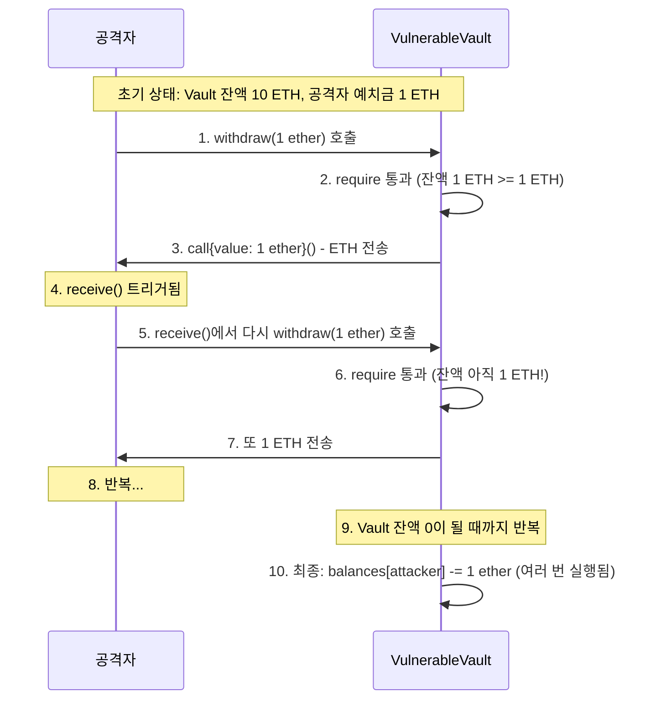

# Week 3 퀴즈: EVM/Security patterns

**제출 방법:**
1. 이 파일을 복사하여 `quiz-03-solution.md`로 저장
2. 각 문제에 답변 작성 (왜 그런지 설명 포함)
3. Pull Request 생성 (`quiz_submission` 템플릿 사용)

---

## 문제 1: [이론] EVM 개념 (객관식)

EVM(Ethereum Virtual Machine)이 "결정론적(deterministic)"으로 실행되어야 하는 이유는?

**보기:**
A) 모든 노드가 같은 CPU를 사용해야 하므로
B) 모든 노드가 같은 입력에 대해 같은 결과를 얻어야 합의가 가능하므로
C) 트랜잭션 처리 속도를 높이기 위해
D) 개발자가 코드를 디버깅하기 쉽게 하기 위해

**답변:**
정답: B
EVM에서 결정론적 실행이 보장되지 않고 예를 들어 외부 랜덤 함수나 인터넷 API 호출이 허용된다면, 전 세계에 흩어진 노드들이 트랜잭션을 확인할 때 제각각 다른 결과를 도출하게 됩니다. 노드들끼리 동일한 세계 상태(World State)를 유지해야 하는 블록체인의 합의 알고리즘 원칙이 무너지기 때문에 반드시 결정론적으로 동작되어야 합니다.

---

## 문제 2: [이론] Storage vs Memory (객관식)

다음 코드에서 `data` 변수의 저장 위치와 특성을 올바르게 설명한 것은?

```solidity
function process(uint[] memory data) public pure returns (uint) {
    uint sum = 0;
    for (uint i = 0; i < data.length; i++) {
        sum += data[i];
    }
    return sum;
}
```

**보기:**
A) Storage에 저장되며 함수 종료 후에도 유지된다
B) Memory에 저장되며 함수 종료 시 삭제된다
C) Stack에 저장되며 가장 비싼 저장 공간이다
D) Calldata에 저장되며 수정이 가능하다

**답변:**
정답: B
비용 차이를 비교하자면 **Storage > Memory > Stack** 순으로 비쌉니다.
Storage는 블록체인의 모든 노드 디스크에 데이터를 영구적으로 기록해야 하므로 가장 막대한 형태의 가스비(수수료)가 요구됩니다.
반면 Memory는 함수 실행 중 임시로 데이터를 담아뒀다가 실행이 끝나면 지워지기 때문에 비교적 매우 저렴합니다. Stack은 단순 변수나 포인터 저장을 위한 가장 저렴하고 작은 데이터 저장소입니다.

---

## 문제 3: [이론] Gas 비용 (객관식)

다음 중 Gas 비용이 가장 높은 연산은?

**보기:**
A) ADD (덧셈)
B) MUL (곱셈)
C) SLOAD (Storage 읽기)
D) SSTORE (Storage 쓰기)

**답변:**
정답: D
이더리움 시스템 전역의 모든 노드들이 영구적인 데이터베이스 저장 공간(Storage)의 상태(State) 매핑 트리 구조를 업데이트하고 블록에 담아 모든 네트워크에 전파해 동기화해야 하는 작업이기 때문에 가장 무거운 연산이며, 따라서 이 작업에 가스비가 가장 높게 산정됩니다.

---

## 문제 4: [이론] CEI 패턴 (단답형)

**왜** CEI(Checks-Effects-Interactions) 패턴에서 Effects(상태 변경)가 Interactions(외부 호출)보다 먼저 와야 하나요?

재진입 공격 시나리오와 연결해서 구체적으로 설명하세요.

**답변:**
만약 상태 변경(잔액 차감 등)보다 외부 호출(상대 컨트랙트에게 ETH 전송)이 먼저 이루어지면, ETH 송금을 트리거 받은 공격자 컨트랙트는 자신의 `receive()` 콜백 함수를 통해 원본 컨트랙트의 `withdraw()` 함수를 재진입하여 또다시 호출할 수 있습니다. 이때 상태가 아직 미반영(미차감)된 상태이기 때문에 `require` 검증을 뚫고 통과해 사실상 무한히 자금을 탈취해 나갈 수 있는 치명적 허점이 생성됩니다. 

---

## 문제 5: [이론] The DAO 사건 교훈 (단답형)

2016년 The DAO 해킹($60M 피해)에서 우리가 배워야 할 **가장 중요한 교훈**은 무엇인가요?

이 사건 이후 이더리움 생태계에 어떤 변화가 있었나요?

**답변:**
기술적 교훈: 외부 컨트랙트의 주소로 코드를 호출(`call`)할 때는 항상 재진입의 가능성이 있음을 인식해야 하며, 상태를 변경한 뒤에야 상호작용하는 체계적인 CEI 작성 원칙, 그리고 ReentrancyGuard 같은 보안 모놀리틱 패턴이 필수적이라는 것입니다.
생태계 교훈: 해킹된 자금을 회수하기 위해 불가피하게 커뮤니티가 코드를 되돌리는 강경 조치(하드 포크)를 선택함으로써, "코드가 법(Code is Law)"이라는 원칙을 고수하는 진영이 이더리움 클래식(ETC)으로 쪼개져 남았고 현행 이더리움(ETH)으로 나뉘는 블록체인 역사상 가장 거대한 체인 분리를 겪었습니다.

---

## 문제 6: [코드] 재진입 공격 식별 (취약점 찾기)

다음 코드에서 재진입 공격 취약점을 찾으세요:

```solidity
// BAD CODE - 취약점 찾기
contract VulnerableVault {
    mapping(address => uint256) public balances;

    function deposit() public payable {
        balances[msg.sender] += msg.value;
    }

    function withdraw(uint256 amount) public {
        require(balances[msg.sender] >= amount, "Insufficient balance");

        // ETH 전송
        (bool success, ) = msg.sender.call{value: amount}("");
        require(success, "Transfer failed");

        // 잔액 차감
        balances[msg.sender] -= amount;
    }
}
```

**1) 발견한 취약점:**
`withdraw` 함수 내에서 외부 컨트랙트에 대한 상호작용인 `call` 이 일어난 뒤에야 `balances`를 차감하는 상태 변경 코드 로직 순서에 심각한 재진입 취약점이 존재합니다. 

**2) 왜 이것이 문제인가:**
공격자가 악성 스마트 컨트랙트를 작성하여 1 ETH를 `deposit` 한 후 `withdraw(1 ETH)`를 신청합니다. 컨트랙트가 외부로 이더리움을 넘겨줄 때 공격자의 컨트랙트에선 `receive()` 함수가 발동되도록 설정되어 있으며, 이 내부에서 다시금 `withdraw(1 ETH)`를 호출합니다. 아직 아래의 `balances -= amount` 코드가 실행되지 않았기에 공격자의 `balance`가 남아있다고 간주되어 계속 인출이 연쇄 작용(반복)합니다.

**3) 올바른 수정 방법 (CEI 패턴):**
```solidity
// GOOD CODE - CEI 패턴으로 수정하세요
function withdraw(uint256 amount) public {
    require(balances[msg.sender] >= amount, "Insufficient balance"); // Checks
    
    balances[msg.sender] -= amount; // Effects
    
    (bool success, ) = msg.sender.call{value: amount}(""); // Interactions
    require(success, "Transfer failed");
}
```

---

## 문제 7: [코드] CEI 패턴 구현 (빈칸 채우기)

다음 코드의 빈칸을 채워 CEI 패턴을 완성하세요:

```solidity
function secureWithdraw(uint256 amount) public {
    // 1. Checks - 조건 확인
    require(balances[msg.sender] >= amount, "Insufficient balance");

    // 2. Effects - 상태 변경 (외부 호출 전에!)
    balances[msg.sender] -= amount;

    // 3. Interactions - 외부 호출 (마지막에!)
    (bool success, ) = msg.sender.call{value: amount}("");
    require(success, "Transfer failed");
}
```

**왜 이 순서가 중요한가요:**
Check-Effects-Interactions 순서를 따르면 외부 함수 호출이 이루어지기 전에 상태(`balances`) 변수가 완전히 최신화(차감) 되기 때문에, 설령 외부에서 재호출(재진입)해 들어오더라도 처음 실행되는 `require` 단계(Checks)에서 잔액 부족으로 Revert 당하게 되며 재진입 공격을 원천적으로 차단합니다.

---

## 문제 8: [코드] tx.origin 취약점 (취약점 찾기)

다음 코드에서 보안 취약점을 찾으세요:

```solidity
// BAD CODE - 취약점 찾기
contract PhishingVulnerable {
    address public owner;

    constructor() {
        owner = msg.sender;
    }

    function transferOwnership(address newOwner) public {
        require(tx.origin == owner, "Not owner");
        owner = newOwner;
    }
}
```

**1) 발견한 취약점:**
블록체인 시스템 트랜잭션의 발원지 주소 계정인 `tx.origin` 값을 활용해 오너 권한 획득 여부를 검증하고 있습니다.

**2) 공격 시나리오:**
공격자는 에어드랍 혹은 무료 NFT 제공 등으로 유인하는 미끼용 스마트 컨트랙트를 만들고, 오너(owner)가 해당 컨트랙트의 특정 함수를 실행하게 속입니다. 그 미끼용 함수 로직 내부에 `PhishingVulnerable.transferOwnership(공격자 소유지갑 주소)`를 호출하는 백도어 명령을 심어 놓습니다. 이렇게 되면 컨트랙트 입장에선 호출자가 이어진 컨트랙트 체인이라도 트랜잭션을 "최초 생성"한 `tx.origin`은 오너 본인 지갑이기 때문에 조건문을 통과해버리고 컨트랙트 영구 관리권이 무방비로 침탈당하게 됩니다.

**3) 올바른 수정 방법:**
```solidity
// GOOD CODE - 수정된 코드를 작성하세요
    function transferOwnership(address newOwner) public {
        // tx.origin 대신 직전 함수를 호출한 주체인 msg.sender를 사용해 악성 프록시 호출을 대처합니다
        require(msg.sender == owner, "Not owner");
        owner = newOwner;
    }
```

---

## 문제 9: [코드] ReentrancyGuard 적용 (빈칸 채우기)

다음 코드의 빈칸을 채워 ReentrancyGuard를 적용하세요:

```solidity
// TODO: OpenZeppelin import
import "@openzeppelin/contracts/utils/ReentrancyGuard.sol";

// TODO: 상속 추가
contract SecureVault is ReentrancyGuard {
    mapping(address => uint256) public balances;

    function deposit() public payable {
        balances[msg.sender] += msg.value;
    }

    // TODO: modifier 추가
    function withdraw(uint256 amount) public nonReentrant {
        require(balances[msg.sender] >= amount, "Insufficient");
        balances[msg.sender] -= amount;
        (bool success, ) = msg.sender.call{value: amount}("");
        require(success, "Failed");
    }
}
```

**CEI 패턴 vs ReentrancyGuard - 언제 무엇을 사용하나요:**
- CEI 패턴은 개발자가 로직의 순서만을 다듬어서 방어하므로 별도의 추가 가스 오버헤드가 없고 외부 라이브러리 의존성을 피할 수 있습니다 (로직이 단순하거나 극도로 효율성이 중시되는 경우).
- ReentrancyGuard는 플래그 변수를 직접 사용해 해당 함수 실행이 완전히 끝날 때까지 락(Lock)을 걸어 차단하므로 2,500 정도의 가스가 더 들지만 매우 직관적이고 견고합니다 (로직이 복잡하고 다양한 컨트랙트 상호작용이 존재하는 프로덕션 환경의 경우 혼용하여 2중 방어를 하는 것이 추천됩니다).

---

## 문제 10: [다이어그램] 재진입 공격 흐름 해석 (다이어그램 분석)

다음 재진입 공격 시퀀스 다이어그램을 분석하세요:



**질문 1:** 6번에서 require 체크가 통과하는 이유는 무엇인가요?

**답변:**
1번의 처음 호출에 의해 실행된 트랜잭션의 컨тек스트가 채 끝나기도 전에 `withdraw`가 끼어들어 호출되었고, 1번 컨텍스트에서 아직 `balances[msg.sender] -= 1`을 처리하는 상태 변경 로직 순서에 도달하지 못해 `balances[attacker]` 배열값이 여전히 1 ether로 남아 있었기 때문에 6번 진입 시도의 `require` 체크 로직 조건을 통과해버린 것입니다.

**질문 2:** CEI 패턴을 적용하면 6번에서 어떻게 되나요?

**답변:**
상태 변경(`balances -= 1`) 코드가 외부 송금(`call`)보다 먼저 존재하게 됩니다. 즉 3번 호출이 발동되기 앞서 이미 공격자의 잔액이 `0`이 되어버리고, 이후 5번에 의해 6번의 재진입 `require` 검증 차례에 오면 `0 >= 1 ether`가 되어 조건 불충족으로 그 즉시 `Revert`(오류 및 상태 롤백) 처리됩니다.

**질문 3:** 공격자가 총 몇 ETH를 탈취할 수 있나요? (예치금 1 ETH, Vault 총 잔액 10 ETH 가정)

**답변:**
공격자는 처음에 맡긴 1 ETH에 더해, Vault에 묶인 전 재산 10 ETH가 완전히 고갈될 때까지 재진입 루프를 돌 수 있습니다. 즉, Vault에 있는 다른 사용자 지분 10 ETH 전체를 모두 털어갈 수 있습니다.

---

## 자기 평가

모든 문제를 풀었다면, 아래 체크리스트로 자기 평가를 해보세요:

- [x] EVM의 결정론적 실행 필요성을 이해했다
- [x] Storage/Memory/Stack의 차이와 비용을 알고 있다
- [x] 재진입 공격의 원리를 설명할 수 있다
- [x] CEI 패턴으로 재진입 공격을 방어할 수 있다
- [x] tx.origin vs msg.sender의 보안 차이를 알고 있다
- [x] ReentrancyGuard를 적용할 수 있다
