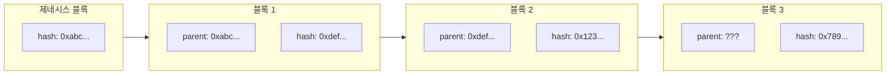
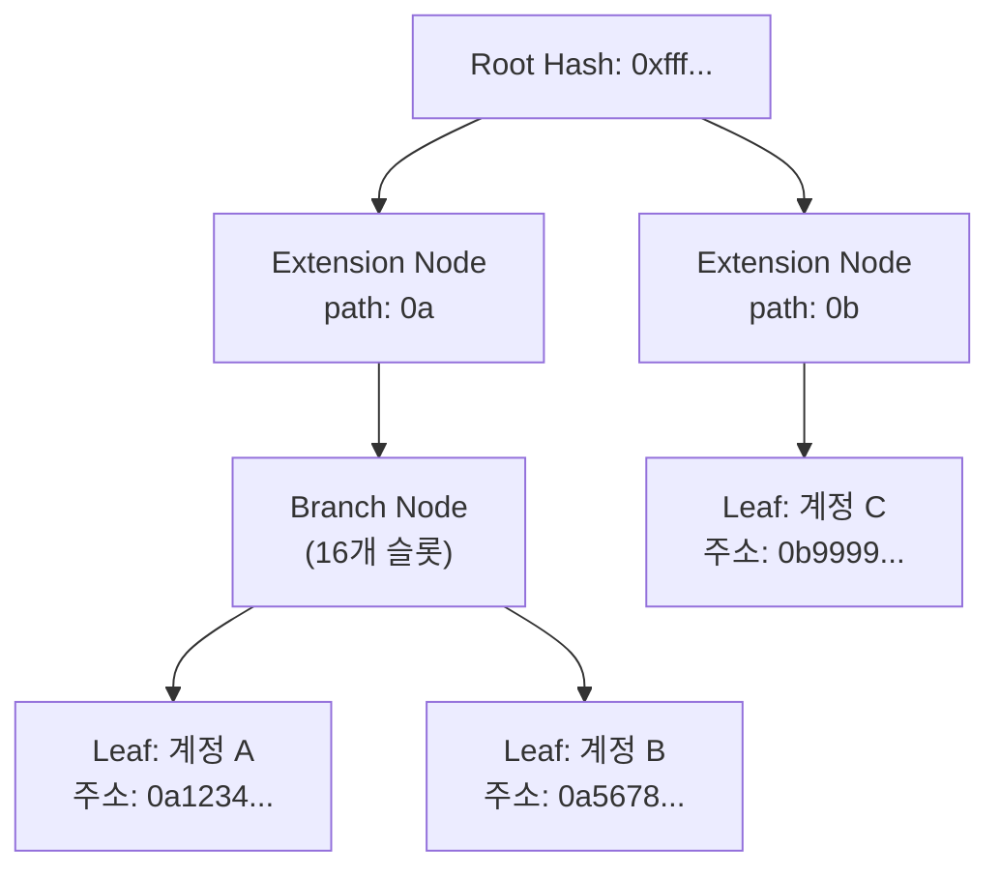

# Week 4 Quiz: Network/Block + wagmi

> **제출 방법:** 이 파일을 복사하여 답변을 작성한 후, PR로 제출하세요.
> **평가 기준:** 개념 이해도 중심 - 문법 오류보다 논리적 설명을 중시합니다.

---

## 문제 1: 블록 헤더 필드 (객관식)

다음 상황을 고려하세요:

```
블록 100의 해시: 0xabc123...
블록 101의 해시: 0xdef456...
```

블록 101의 `parentHash` 필드에는 어떤 값이 저장되어 있나요? 그리고 **왜** 이런 방식으로 연결하나요?

**보기:**
A) 0xdef456... - 자기 자신의 해시를 저장하여 무결성을 보장한다
B) 0xabc123... - 이전 블록의 해시를 저장하여 체인 연결과 불변성을 보장한다
C) 블록 번호 100 - 숫자로 순서를 추적한다
D) 빈 값 - 헤더에는 해시가 저장되지 않는다

**답변:**
B

**이유:**
이전 블록의 해시를 저장하여 블록들이 체인 형태로 서로 연결되게 하고, 한 블록의 데이터가 아주 조금이라도 변경되면 이후 모든 블록의 해시가 연쇄적으로 바뀌게 하여 위변조를 막고 무결성을 보장하기 위해서입니다.
A는 자기 자신의 해시를 저장한다는 점에서 틀렸으며, C는 블록 번호가 아니라 해시값을 사용하여 암호학적 연결을 보장하기 때문에 틀린 설명입니다. D는 실제로 헤더에 해시가 명시적으로 저장되므로 오답입니다.---

## 문제 2: MPT 목적 (객관식)

이더리움에서 Merkle Patricia Trie(MPT)를 사용하는 **가장 중요한 이유**는 무엇인가요?

**보기:**
A) 데이터를 암호화하여 외부에서 읽을 수 없게 한다
B) 트랜잭션 처리 속도를 10배 이상 높인다
C) 전체 데이터 없이도 특정 데이터의 존재와 정확성을 효율적으로 증명한다
D) 블록 크기를 줄여서 저장 공간을 절약한다

**답변:**
C

**이유:**
MPT의 주요 장점은 일부 데이터의 해시 경로(Merkle Proof)만 제공받아 검증할 수 있다는 점입니다. 이를 통해 전체 상태 데이터를 다운로드하지 못하는 Light Node 환경에서도 저장 공간을 아끼고, 네트워크 대역폭 소모를 최소화하면서 특정 트랜잭션이나 계정 데이터의 존재 여부 및 무결성을 빠르고 효율적으로 증명할 수 있습니다.---

## 문제 3: 체인 연결과 보안 (객관식)

공격자가 블록 50의 트랜잭션을 수정하려고 합니다. 현재 체인의 최신 블록은 100입니다. 이 공격이 **왜** 어려운가요?

**보기:**
A) 블록 50은 너무 오래되어서 시스템에서 접근할 수 없다
B) 블록 50을 수정하면 해시가 바뀌고, 블록 51부터 100까지 모든 블록의 parentHash가 불일치하게 된다
C) 블록 50은 이미 암호화되어 있어서 복호화 키가 필요하다
D) 네트워크 관리자만 과거 블록을 수정할 수 있다

**답변:**
B

**이유:**
블록체인은 블록에 포함된 각 거래의 변경이 머클 루트를 바꾸고, 머클 루트의 변경은 블록 헤더의 최종 해시값을 완전히 다르게 만듭니다. 블록 50의 트랜잭션을 수정하면 블록 50의 해시가 바뀌기 때문에, 그 바뀐 해시를 `parentHash`로 유지하기 위해서는 블록 51, 블록 52... 그리고 현재 최신 블록 100까지 각 블록 해시를 모두 다시 계산하여야 합니다. 작업증명(또는 합의 과정)을 통과한 이 연쇄적인 수정을 공격자가 최신 체인보다 길고 유효한 체인으로 만들 수 없기 때문에 실제로는 불가능에 가까운 난이도를 갖게 됩니다.---

## 문제 4: MPT 진화 과정 (단답형)

MPT(Merkle Patricia Trie)는 세 가지 자료구조의 장점을 결합한 것입니다:
1. **Trie** -> 2. **Patricia Trie** -> 3. **Merkle Patricia Trie**

**왜** 각 단계의 발전이 필요했나요? 각 단계가 해결하는 문제를 간단히 설명하세요.

**답변:**
1. **Trie가 해결하는 문제:** 
공통 접두사를 공유하여 계층형 구조로 키를 효율적으로 찾아가도록 하여 문자열이나 주소를 검색하는 성능을 향상시키는 문제를 해결합니다.

2. **Patricia Trie가 해결하는 문제 (Trie의 한계):** 
기본 Trie는 주소 1글자마다 노드를 1개씩 만들어야 해서 분기가 없는 경로에서도 무의미하게 트리의 깊이가 깊어지고 메모리가 낭비됩니다. Patricia Trie는 공통된 단일 경로를 하나로 합치는 노드(Extension Node)를 사용하여 탐색 경로를 단축시키고 공간 효율을 대폭 개선합니다.

3. **Merkle Patricia Trie가 해결하는 문제 (Patricia Trie의 한계):** 
Patricia Trie만으로는 트리 안에 저장된 상태들의 변경이나 무결성을 한 번에 증명할 수 없습니다. 따라서 노드마다 하위 노드들의 해시값을 포함시켜 루트 노드로 거슬러 올라가는 머클 트리(Merkle Tree) 구조를 도입함으로써, 루트 해시 단 하나만으로 전체 데이터 구조의 완벽한 암호학적 검증과 무결성 증명(Proof)을 가능하게 합니다.---

## 문제 5: Eclipse Attack 방어 (단답형)

Eclipse Attack은 공격자가 피해자 노드의 **모든 피어 연결**을 자신이 통제하는 노드로 바꾸는 공격입니다.

1) 이 공격이 성공하면 피해자에게 **어떤 피해**가 발생할 수 있나요?
2) 개인 노드 운영자가 이 공격을 **방어**하기 위해 할 수 있는 행동은 무엇인가요?

**답변:**
1) **가능한 피해 (2가지 이상):**
   - 네트워크로부터 완전히 고립되어, 최신 블록이나 트랜잭션 동기화 등 올바른 상태 정보를 차단당합니다.
   - 공격자가 조작된 허위 체인이나 트랜잭션을 공급하여 이중 지불(Double Spending) 피해를 입힐 수 있습니다.
   - 피해자가 발행한 정상적인 트랜잭션이 전혀 전파되지 않는 검열/블랙홀 현상이 일어납니다.

2) **방어 방법 (2가지 이상):**
   - 접속 IP와 서브넷을 엄격히 관리하여 너무 많은 피어가 동일 네트워크(IP 대역)에 몰려있지 않도록 제한합니다.
   - 신뢰할 수 있는 피어(예: 공식 부트노드 또는 사용자 고정 노드 등)를 하드코딩하거나 우선적으로 연결되게 설정합니다.
   - 피어의 최대 연결 수(Max Peers) 제한과 인바운드/아웃바운드 슬롯의 비율을 조절해 새 피어가 무단으로 연결 슬롯을 모두 장악하는 것을 방지합니다.---

## 문제 6: 노드 종류 선택 (단답형)

친구가 이더리움 개발을 시작하려고 합니다. 다음 세 가지 상황에서 각각 어떤 노드 타입(Full, Light, Archive)을 추천하시겠습니까? **왜** 그 노드를 추천하는지도 설명하세요.

1) 모바일 지갑 앱 개발
2) 블록체인 데이터 분석 서비스 개발
3) 일반적인 dApp 백엔드 개발

**답변:**
1) **모바일 지갑 앱:**
   - **추천 노드:** Light Node
   - **이유:** 모바일 기기는 높은 CPU 성능과 대용량 저장공간, 그리고 대역폭을 항상 쓰기 어렵습니다. 따라서 모든 트랜잭션 데이터를 받을 필요 없이 블록 헤더와 머클 증명(Merkle Proof)만을 받아 최소한의 자원으로 지갑 잔고 검증과 트랜잭션 확인이 가능한 Light Node가 적합합니다.

2) **블록체인 데이터 분석:**
   - **추천 노드:** Archive Node
   - **이유:** 이 서비스는 과거 특정 시점의 토큰 잔고, 또는 스마트 컨트랙트의 이전 상태를 광범위하게 계속 조회해야 할 수 있습니다. 일반 노드는 과거 상태를 제거(pruning)하므로 쿼리를 못할 수 있으며 모든 블록 시점에서의 원시 상태 트리를 계속 보존하고 있는 Archive Node만이 이러한 온체인 데이터의 정밀한 조회를 가능하게 합니다.

3) **dApp 백엔드:**
   - **추천 노드:** Full Node
   - **이유:** 현재 메인넷의 트랜잭션을 전파하고, 최신 상태를 기반으로 이벤트를 수신하는 등 대부분의 통신 역할에는 Full Node 하나면 기능적으로 충분합니다. Archive Node만큼 방대한 스토리지 비용을 쓰지 않으면서도 온전한 데이터 검증과 RPC 요청 처리가 가능하기 때문에 가장 합리적인 서버 자원으로 운영할 수 있습니다.---

## 문제 7: useAccount Hook (빈칸 채우기)

다음 코드의 빈칸을 채워서 지갑 연결 상태를 표시하는 컴포넌트를 완성하세요:

**답변:**
```typescript
import { useAccount } from 'wagmi';

function WalletStatus() {
  // TODO: useAccount hook에서 필요한 값들을 가져오세요
  const { address, isConnected } = useAccount();

  if (!isConnected) {
    return <div>지갑이 연결되지 않았습니다</div>;
  }

  return (
    <div>
      <p>연결된 주소: {address}</p>
    </div>
  );
}
```

**왜 이렇게 작성했나요:**
`useAccount` 훅은 지갑의 현재 연결 정보와 상태를 확인할 때 사용합니다.
- `isConnected`: 현재 사용자의 지갑이 연결되어 활성화된 상태인지 불리언으로 알려줍니다.
- `address`: 연결된 경우 실제 사용 중인 계정의 퍼블릭 주소 값(0x...)을 가져옵니다. 
이를 통해 isConnected가 false라면 미연결 UI를 반환하고, 연결된 상태라면 address를 성공적으로 렌더링하기 위해 사용합니다.
---

## 문제 8: useReadContract Hook (빈칸 채우기)

다음 코드의 빈칸을 채워서 컨트랙트의 `getCount` 함수 결과를 화면에 표시하세요:

**답변:**
```typescript
import { useReadContract } from 'wagmi';

const counterABI = [
  {
    name: 'getCount',
    type: 'function',
    stateMutability: 'view',
    inputs: [],
    outputs: [{ name: 'count', type: 'uint256' }],
  },
] as const;

function CountDisplay() {
  const { data, isLoading, error } = useReadContract({
    // TODO: 필요한 설정을 채우세요
    address: '0x1234...5678',
    abi: counterABI,
    functionName: 'getCount',
  });

  if (isLoading) return <div>로딩 중...</div>;
  if (error) return <div>에러 발생</div>;

  return <div>현재 카운트: {data?.toString()}</div>;
}
```

**왜 이렇게 작성했나요:**
`useReadContract`를 호출하기 위해서는 `address`외에도 함수 인터페이스 역할을 하는 `abi`와, 호출할 읽기 전용 함수 이름인 `functionName`이 필수로 설정되어야 합니다.
또한 `data` 값은 반환되는 uint256을 표현하기 위해 내부적으로 `bigint` 타입 객체로 주어지기 때문에, React 트리에 안전하게 렌더링하려면 `.toString()` 메서드를 통해 문자열로 직접 변환해주어야 합니다.
---

## 문제 9: useWriteContract 버그 (취약점 찾기)

다음 코드에서 **문제점**을 찾고 수정하세요:

```typescript
// BAD CODE - 문제점 찾기
import { useWriteContract } from 'wagmi';

function IncrementButton() {
  const { writeContract, isPending } = useWriteContract();

  const handleClick = () => {
    // 문제가 있는 코드
    writeContract({
      address: '0x1234...5678',
      functionName: 'increment',
      // abi가 없음!
    });
  };

  return (
    <button onClick={handleClick} disabled={isPending}>
      증가하기
    </button>
  );
}
```

**1) 발견한 문제점:**
`writeContract({ address, functionName })` 호출 시 해당 함수명에 매칭되는 입력/인터페이스 스펙인 `abi` 항목이 파라미터에서 빠져 있습니다.

**2) 왜 이것이 문제인가:**
어떤 파라미터 타입이나 인터페이스로 트랜잭션 콜 데이터를 인코딩해야 하는지 wagmi(viem)가 알 수 없습니다. `abi`가 없으면 컨트랙트에 전달할 데이터를 올바르게 직렬화하지 못하고 인코딩 오류와 함께 트랜잭션 발생이 아예 실패하게 됩니다.

**3) 올바른 수정 방법:**
```typescript
// GOOD CODE - 수정된 버전을 작성하세요
import { useWriteContract } from 'wagmi';
// 사용할 abi가 정의되어 있다고 가정합니다.
import { counterABI } from './abi'; 

function IncrementButton() {
  const { writeContract, isPending } = useWriteContract();

  const handleClick = () => {
    writeContract({
      address: '0x1234...5678',
      abi: counterABI,
      functionName: 'increment',
    });
  };

  return (
    <button onClick={handleClick} disabled={isPending}>
      증가하기
    </button>
  );
}
```
---

## 문제 10: 블록 연결 구조 (다이어그램 해석)

다음 다이어그램은 블록체인의 연결 구조를 보여줍니다:



**질문:**

1) 블록 3의 `parent: ???` 에 들어갈 값은 무엇인가요?
블록 2의 해시인 `0x123...` 입니다.

2) 만약 블록 1의 내용이 수정되면, 블록 2와 블록 3에 **어떤 영향**이 있나요? 왜 그런가요?
블록 1의 내용이 수정되면 블록 1의 최종 해시값(`0xdef...`)이 수학적으로 완전히 달라지게 됩니다. 그러면 이 해시값을 자신의 `parentHash`로 사용하는 블록 2 역시 헤더 필드가 바뀌어 자체 해시값이 틀려지고 갱신됩니다. 이 변경이 연쇄적으로 블록 3의 부모 해시 변경까지 야기하여 모든 블록의 해시가 재설정되어야 하므로 기존의 블록 2와 블록 3은 네트워크에서 유효하지 않은 블록으로 무력화됩니다.

3) 제네시스 블록(블록 0)의 parentHash는 어떤 특별한 값을 가지나요? 왜 그런가요?
`0x0000000000000000000000000000000000000000000000000000000000000000` (기본값, 즉 모두 0인 값)을 가집니다. 체인의 가장 맨 처음 생성된 블록이므로, 그 이전에는 가리킬 부모 블록 자체가 존재하지 않기 때문입니다.
---

## 문제 11: MPT 트리 구조 (다이어그램 해석)

다음 다이어그램은 MPT의 노드 구조를 보여줍니다:



**질문:**

1) 계정 A와 계정 B가 같은 Branch Node 아래에 있는 이유는 무엇인가요? (주소 패턴을 힌트로 사용하세요)
두 계정 주소(`0a1234...`, `0a5678...`) 모두 첫 시작이 `0a`라는 공통된 부모 경로 접두사(Prefix)를 공유하고 있기 때문입니다. 공통으로 묶인 Extension Node(`path: 0a`)를 거친 뒤, 그 다음 글자인 `1`과 `5` 시점부터 해당 Branch Node 안의 개별 슬롯으로 분기하여 Leaf 노드가 됩니다.

2) Extension Node가 하는 역할은 무엇인가요? 없다면 어떤 문제가 생기나요?
역할: 서로 다른 노드들이 공통적으로 가지고 있는 경로 부분 문자열(Prefix)을 중간에서 압축하여 하나로 묶어주는 역할을 합니다.
만약 없다면: 공통 부분이라 할지라도 한 글자(1 Nibble) 단위마다 오직 하나씩만 자식이 존재하더라도 계속해서 Branch Node를 만들게 되어, 노드가 지나치게 많아지고 트리의 깊이가 불필요하게 깊어져 저장 용량이 극심하게 낭비되고 탐색 성능이 저하됩니다.

3) Root Hash만 알면 어떻게 특정 계정의 데이터 존재를 **증명**할 수 있나요? (Light Client 관점에서)
해당 계정이 저장된 Leaf Node부터 Root까지 이어지는 경로에 나타난 노드들의 해시 리스트인 트리 증명(Merkle Proof) 데이터를 Full Node 등에서 받아옵니다. Light Client는 노드 내부 데이터들의 해시를 차례대로 역방향으로 재계산(Hashing)하고, 최종적으로 도달한 자신의 계산 결과가 이미 신뢰하고 보관 중인 Root Hash와 완벽하게 일치하는지 비교함으로써 중간 데이터의 위변조가 없다는 완전한 존재 증명을 수행합니다.
---

## 제출 전 체크리스트

- [ ] 모든 문제에 답변을 작성했는가?
- [ ] 객관식 문제: 정답 선택 **이유**를 설명했는가?
- [ ] 단답형 문제: 2-3문장 이상으로 충분히 설명했는가?
- [ ] 코드 문제: 완성된 코드와 **왜 그렇게 작성했는지** 설명했는가?
- [ ] 다이어그램 문제: 각 질문에 논리적으로 답변했는가?
