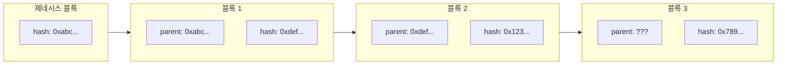
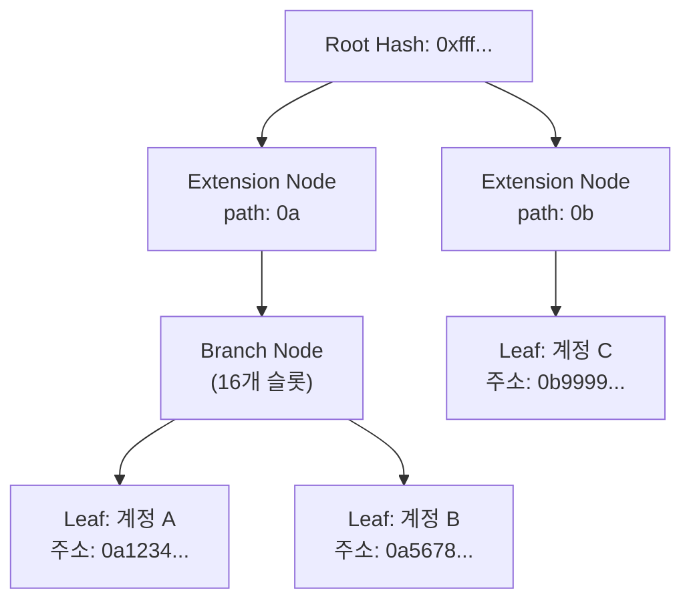

# Week 4 Quiz: Network/Block + wagmi

**제출 방법:** 이 파일을 복사하여 답변을 작성한 후, PR로 제출하세요.
**평가 기준:** 개념 이해도 중심 - 문법 오류보다 논리적 설명을 중시합니다.

---

## 문제 1: 블록 헤더 필드 (객관식)

다음 상황을 고려하세요:

```
블록 100의 해시: 0xabc123...
블록 101의 해시: 0xdef456...
```

블록 101의 `parentHash` 필드에는 어떤 값이 저장되어 있나요? 그리고 **왜** 이런 방식으로 연결하나요?

**보기:**
A) 0xdef456... - 자기 자신의 해시를 저장하여 무결성을 보장한다
B) 0xabc123... - 이전 블록의 해시를 저장하여 체인 연결과 불변성을 보장한다
C) 블록 번호 100 - 숫자로 순서를 추적한다
D) 빈 값 - 헤더에는 해시가 저장되지 않는다

**답변:**
정답: B
블록체인의 기본 원리는 새로 채굴된 블록 내부에 직전 블록의 고유 해시(`parentHash`)를 고스란히 담아 사슬처럼 묶인 단방향 링크드 리스트 구조를 띠게 하는 것입니다. 이렇게 하면 과거 블록의 정보가 단 1비트라도 조작될 경우, 그것의 해시값이 완전히 달라져 후속 블록들의 parentHash 체인이 도미노처럼 줄줄이 불일치하게 되므로 과거 데이터의 무결성과 불변성(Immutability)을 강력하게 보장해주기 때문입니다. 다른 보기들은 부모 해시값을 참조하지 않아 체인의 연속성을 유지할 수 없으므로 모두 틀렸습니다.

---

## 문제 2: MPT 목적 (객관식)

이더리움에서 Merkle Patricia Trie(MPT)를 사용하는 **가장 중요한 이유**는 무엇인가요?

**보기:**
A) 데이터를 암호화하여 외부에서 읽을 수 없게 한다
B) 트랜잭션 처리 속도를 10배 이상 높인다
C) 전체 데이터 없이도 특정 데이터의 존재와 정확성을 효율적으로 증명한다
D) 블록 크기를 줄여서 저장 공간을 절약한다

**답변:**
정답: C
이더리움은 탈중앙 네트워크에 누구나 참여해 검증할 수 있어야 합니다. 스마트폰이나 용량이 부족한 장비에서 풀 노드의 수백 GB 이상의 모든 장부 원본 데이터를 다운로딩하지 않고도, 라이트 노드(Light Node) 환경에서 검증할 대상 경로에 대한 데이터 일부 조각(Merkle Proof)과 루트 해시(Root Hash)만으로 해당 트랜잭션 혹은 특정 구좌 잔액 등이 진짜 블록 구조 내에 속해 있고 무결한지를 빠르고 고효율로 암호학적 증명을 수행하기 위함입니다.

---

## 문제 3: 체인 연결과 보안 (객관식)

공격자가 블록 50의 트랜잭션을 수정하려고 합니다. 현재 체인의 최신 블록은 100입니다. 이 공격이 **왜** 어려운가요?

**보기:**
A) 블록 50은 너무 오래되어서 시스템에서 접근할 수 없다
B) 블록 50을 수정하면 해시가 바뀌고, 블록 51부터 100까지 모든 블록의 parentHash가 불일치하게 된다
C) 블록 50은 이미 암호화되어 있어서 복호화 키가 필요하다
D) 네트워크 관리자만 과거 블록을 수정할 수 있다

**답변:**
정답: B
이더리움 블록체인에서 과거 블록 트랜잭션을 마음대로 하나 변경하면 그 조작된 블록을 기점으로 산출되는 새 블록 해시가 기존과 전혀 달라지게 됩니다. 그러면 바로 다음에 연동되는 블록 51, 블록 52... 결국 최신 100번까지 이어지는 체인의 연결고리가 모조리 박살 나 튕겨납니다. 공격자가 이걸 무마하려면 나머지 모든 네트워크 구성원들의 해시 검증 연산(채굴이나 슬래싱 대치 등) 파워를 뛰어넘어 100번 블록 너머까지 제일 긴 체인을 자신만의 위조 장부로 다시 만들어 탈취해야 하는데, 이러한 시도는 투입되는 공격 비용이 압도적으로 비싸서 경제/수학적으로 완전히 불가능(비현실적)하기 때문입니다.

---

## 문제 4: MPT 진화 과정 (단답형)

MPT(Merkle Patricia Trie)는 세 가지 자료구조의 장점을 결합한 것입니다:
1. **Trie** -> 2. **Patricia Trie** -> 3. **Merkle Patricia Trie**

**왜** 각 단계의 발전이 필요했나요? 각 단계가 해결하는 문제를 간단히 설명하세요.

**답변:**
1. Trie가 해결하는 문제: 접두사 트리(Prefix Tree)라고도 불리며, 여러 키(Key) 값들이 문자열 공통 접두사를 가질 때 이를 분할된 단계 구조로 구성해 메모리 내에서 데이터가 위치한 효율적인 계층 탐색을 가능케 한다는 이점을 가집니다.
2. Patricia Trie가 해결하는 문제 (Trie의 한계): 기존 단순 Trie 구조에서는 외길로 중복 이어지는 비어 있는 자식 노드들이 너무 많아 트리의 깊이가 끔찍하게 깊고 자원 낭비가 매우 극심했습니다. Patricia Trie는 이렇게 공통 접두사만으로 일렬 연장되는 빈 쓸모없는 공통 경로를 하나의 Extension(확장 노드)로 묶어 다이어트(Path Compression, 경로 압축)시킴으로써 탐색 비용과 트리 용량을 극적으로 개선했습니다.
3. Merkle Patricia Trie가 해결하는 문제 (Patricia Trie의 한계): Patricia Trie 자체로는 특정 하위 가지 노드 데이터에 변조가 일어났는지 추적/무결성 증명을 할 수 없습니다. 이 구조적인 최적화 트리 안에 데이터를 해싱하고 올려 취합해 맨 위의 Root Hash에 반영시키는 구조적 특성이 강한 Merkle Tree 원리를 합침(Merge)으로써, 변경 불가능(Immutable)한 서명과 부분 검증의 강력함까지 갖춘 이더리움 전용 MPT가 최종 탄생했습니다.

---

## 문제 5: Eclipse Attack 방어 (단답형)

Eclipse Attack은 공격자가 피해자 노드의 **모든 피어 연결**을 자신이 통제하는 노드로 바꾸는 공격입니다.

1) 이 공격이 성공하면 피해자에게 **어떤 피해**가 발생할 수 있나요?
2) 개인 노드 운영자가 이 공격을 **방어**하기 위해 할 수 있는 행동은 무엇인가요?

**답변:**
1) 가능한 피해 (2가지 이상):
   - 피해자는 악의적인 가짜 네트워크 환경에 마치 갈라파고스 섬처럼 고립되어, 실제로 정상을 달리는 블록체인 네트워크와 동기화되지 못하고 공격자가 임의로 주입시키는 위조된 블록이나 조작된 허위 트랜잭션 정보(이중 지불 공격)를 사실이라 여기고 채택하게 되는 기만 피해에 당합니다.
   - 피해자 노드가 블록을 성공적으로 채굴 및 생성했다 하더라도 외부에 브로드캐스팅되지 못한 채 공격자에 의해서 폐기 처분되므로 채굴 보상을 날리게 되며 블록 생태계 지분을 상실합니다.

2) 방어 방법 (2가지 이상):
   - 악의적인 단일 IP 주소 대역이나 지역 서브넷망에만 피어 커넥션이 집중·편향되어 쏠리는 것을 제한해 다채로운 IP 대역의 무작위 노드들과 연결 네트워크를 맺도록 설정해야 합니다.
   - 최초 부팅 및 동기화를 시작할 때, 공식 재단 등에서 안전하다고 검증되고 하드코딩된 '신뢰도 높은 고정 노드 IP (Bootnodes/Seed Nodes)'와 연결을 맺어 정상 여부를 확인하도록 고정하는 보호책을 두어야 합니다.

---

## 문제 6: 노드 종류 선택 (단답형)

친구가 이더리움 개발을 시작하려고 합니다. 다음 세 가지 상황에서 각각 어떤 노드 타입(Full, Light, Archive)을 추천하시겠습니까? **왜** 그 노드를 추천하는지도 설명하세요.

1) 모바일 지갑 앱 개발
2) 블록체인 데이터 분석 서비스 개발
3) 일반적인 dApp 백엔드 개발

**답변:**
1) 모바일 지갑 앱:
   추천 노드: Light Node
   이유: 스마트폰 하드웨어는 디스크 저장 용량과 동작 배터리 효율이 매우 한정적이므로, 수백기가에 달하는 전체 블록을 내려받기 힘듭니다. 블록의 작은 헤더와 Merkle Proof만으로 자금 잔고나 트랜잭션 처리가 안전한지 초고속으로 효율성 증명을 거칠 수 있기 때문에 안성맞춤입니다.

2) 블록체인 데이터 분석:
   추천 노드: Archive Node
   이유: 이런 서비스들을 런칭하려면 단순히 현재 시점의 상태나 거래 내역뿐만이 아니라, 특정 제네시스와 1번, 2번 등 아주 까마득히 오래된 과거에 일어났던 특정 블록 넘버의 스마트 컨트랙트 상태와 모든 영구적인 원시 기록 데이터(State의 100% 무삭제 원본 트리 변화)가 필요합니다. 이는 엄청난 용량을 차지하더라도 잘라내기 없이 아카이빙 된 노드에서만 제대로 쿼리(Query) 요청이 가능하기 때문입니다.

3) dApp 백엔드:
   추천 노드: Full Node
   이유: 디앱 운영을 위한 통상의 상업 시스템 백엔드로서 가장 이상적이기 때문입니다. 네트워크의 최신 상태(World state)를 빠르고 온전히 스스로 검증하며 유지할 수 있으며 트랜잭션들을 딜레이 없이 신속하게 쏘아 브로드캐스팅해 동기화할 수 있고, 과거 불필요한 모든 과정 아카이빙은 시스템 가디언(Pruning) 기능으로 쳐내어 용량적으로도 합리적 자립성을 구축합니다.

---

## 문제 7: useAccount Hook (빈칸 채우기)

다음 코드의 빈칸을 채워서 지갑 연결 상태를 표시하는 컴포넌트를 완성하세요:

```typescript
import { useAccount } from 'wagmi';

function WalletStatus() {
  // TODO: useAccount hook에서 필요한 값들을 가져오세요
  const { address, isConnected } = useAccount();

  if (!isConnected) {
    return <div>지갑이 연결되지 않았습니다</div>;
  }

  return (
    <div>
      <p>연결된 주소: {address}</p>
    </div>
  );
}
```

**왜 이렇게 작성했나요:**
`useAccount()` Hook은 현재 유저 클라이언트 메타마스크나 월렛 앱 지갑의 연동 정보를 담고 반환해주는 가장 핵심적인 훅입니다. 그 안에서 자바스크립트 객체 구조 분해 할당을 이용해, 블록체인 상에 로그인/연결 여부를 불리언(Boolean) 값으로 나타내는 `isConnected` 와, 사용자의 퍼블릭 계정 지갑 주소 값인 `address` 프로퍼티를 각각 꺼내 와서 조건부 렌더링에 알맞게 배치하기 위해 작성했습니다.

---

## 문제 8: useReadContract Hook (빈칸 채우기)

다음 코드의 빈칸을 채워서 컨트랙트의 `getCount` 함수 결과를 화면에 표시하세요:

```typescript
import { useReadContract } from 'wagmi';

const counterABI = [
  {
    name: 'getCount',
    type: 'function',
    stateMutability: 'view',
    inputs: [],
    outputs: [{ name: 'count', type: 'uint256' }],
  },
] as const;

function CountDisplay() {
  const { data, isLoading, error } = useReadContract({
    // TODO: 필요한 설정을 채우세요
    address: '0x1234...5678',
    abi: counterABI,
    functionName: 'getCount',
  });

  if (isLoading) return <div>로딩 중...</div>;
  if (error) return <div>에러 발생</div>;

  return <div>현재 카운트: {data?.toString()}</div>;
}
```

**왜 이렇게 작성했나요:**
`useReadContract` 로 네트워크에서 블록체인 스마트 컨트랙트를 조회해 읽기 위해서는 '어디'에 접근하는지 알려주는 컨트랙트 배포 주소표(`address`), '어떻게' 구조를 읽고 호출해야 하는지 가이드해주는 컴파일된 코드 명세서(`abi`), '어떤 명칭'의 함수를 실행할지 선언하는 호출 타겟팅(`functionName`)의 가장 필수적인 3가지 셋업 매개변수 값 조각들이 필요하기 때문입니다.
또한, 이더리움의 응답 수치들은 uint256 같은 큰 BigInt 객체 타입으로 반환되기 때문에, React DOM 화면에 Text로 그리기 위해선 자바스크립트의 `.toString()` 스트링 체이닝 내장 호출을 통해 일반 문자열 형태로 파싱(가공)해주어 런타임 오류나 직렬화 크래시를 방지할 수 있습니다.

---

## 문제 9: useWriteContract 버그 (취약점 찾기)

다음 코드에서 **문제점**을 찾고 수정하세요:

```typescript
// BAD CODE - 문제점 찾기
import { useWriteContract } from 'wagmi';

function IncrementButton() {
  const { writeContract, isPending } = useWriteContract();

  const handleClick = () => {
    // 문제가 있는 코드
    writeContract({
      address: '0x1234...5678',
      functionName: 'increment',
      // abi가 없음!
    });
  };

  return (
    <button onClick={handleClick} disabled={isPending}>
      증가하기
    </button>
  );
}
```

**1) 발견한 문제점:**
`writeContract` 함수로 트랜잭션을 실행하려 하지만 컨트랙트의 명세서 도면인 `abi` 항목 프로퍼티가 통째로 빠져 있습니다.

**2) 왜 이것이 문제인가:**
이더리움 블록체인 네트워크와 프론트엔드가 대화하기 위해선 사용자가 호출하려는 `increment` 함수 내용의 입력 타입과 반환 종류가 어떠한지, 해당 함수의 구체화된 해시 시그니처가 맞는지 등 양측 간 언어를 인코딩하고 이해할 수 있는 명세서(ABI)가 시스템 전역으로 필수적입니다. Wagmi 라이브러리는 `abi` 값을 기반으로 함수를 매핑하고 타입 추론을 수행하므로, 이것이 없다면 인자 오류뿐 아니라 함수 자체를 전송조차 하지 못하고 타입 스크립트 기반 및 런타임상 크래시나 기능 멈춤 고장이 발생하게 됩니다. 

**3) 올바른 수정 방법:**
```typescript
// GOOD CODE - 수정된 버전을 작성하세요
import { useWriteContract } from 'wagmi';

// ABI 추가
const counterABI = [
  {
    name: 'increment',
    type: 'function',
    stateMutability: 'nonpayable',
    inputs: [],
    outputs: [],
  },
] as const;

function IncrementButton() {
  const { writeContract, isPending } = useWriteContract();

  const handleClick = () => {
    // 올바르게 연결된 코드
    writeContract({
      address: '0x1234...5678',
      abi: counterABI,
      functionName: 'increment',
    });
  };

  return (
    <button onClick={handleClick} disabled={isPending}>
      증가하기
    </button>
  );
}
```

---

## 문제 10: 블록 연결 구조 (다이어그램 해석)

다음 다이어그램은 블록체인의 연결 구조를 보여줍니다:



**질문:**

1) 블록 3의 `parent: ???` 에 들어갈 값은 무엇인가요?
- 이전 블록인 블록 2의 고유 해시값인 `0x123...`이 들어갑니다.

2) 만약 블록 1의 내용이 수정되면, 블록 2와 블록 3에 **어떤 영향**이 있나요? 왜 그런가요?
- 블록 1의 데이터가 몰래 조작, 변경되면 블록 1이 가지고 있던 암호학적 해시값인 `0xdef...`가 임의의 새 해시값(예: `0xaaaa...`)으로 바뀌게 됩니다. 그럼 기존 정보 `0xdef...`를 부모 해시로 바라보고 있던 블록 2의 헤더 검증이 실패해 깨짐이 도미노로 일어나 완전히 무효화되고, 블록 2가 바뀌므로 다시 연쇄적으로 발생기를 일으키게 되어 블록 3까지 연결된 모든 후행 블록의 `parentHash`가 도미노 현상처럼 단절되어 버려 네트워크 동기화의 모든 정당성 확인 검증에서 튕겨나 퇴출당하게 됩니다.

3) 제네시스 블록(블록 0)의 parentHash는 어떤 특별한 값을 가지나요? 왜 그런가요?
- 제네시스 블록은 이 블록체인 이념과 역사가 생겨난 맨 첫 번째 "0번 개국 블록"으로 이전에 발생한 블록이란 게 물리적으로 시스템에 아예 존재하지 않습니다. 따라서 어떤 값도 참조할 수 없기 때문에 암호 프로토콜 규약적으로 모두 0으로 이루어진 32 Byte의 빈 고정 데이터 해시(`0x000000.....000000`)를 강제로 갖게 됩니다.

---

## 문제 11: MPT 트리 구조 (다이어그램 해석)

다음 다이어그램은 MPT의 노드 구조를 보여줍니다:



**질문:**

1) 계정 A와 계정 B가 같은 Branch Node 아래에 있는 이유는 무엇인가요? (주소 패턴을 힌트로 사용하세요)
- 계정 A의 탐색 경로는 `0a1234` 이고 계정 B의 경로는 `0a5678` 인데, 두 계정 주소 모두 최상단 루트에서 출발하여 앞글자 `0a`라는 공통된 부모 경로 접두사(Prefix)를 정확히 공유하며 이어왔기 때문에, 이를 통합 압축한 공통 부모 노드인 EXT1 트리를 똑같이 같이 타고 내려오다가 이후 경로(1, 5)에서 갈라질 필요가 생겼으므로 같은 Branch 노드에서 파생된 것입니다.

2) Extension Node가 하는 역할은 무엇인가요? 없다면 어떤 문제가 생기나요?
- 역할: 단순히 자식으로 1분할 되는 경로가 계속 반복적으로 길쭉하게 존재할 때, 이렇게 무수히 공통 경로로 이어지는 가지만 남는 일방통행 노드들을 일의적으로 다 묶어 경로 문자열 하나로 시원하게 합친 뒤 길이를 단축 압축(Path Compression)하는 결정적 역할을 합니다.
- 문제: 이게 없다면 그냥 기본 `0-a` 로 한칸씩 내려가는 단순한 Trie가 되며, 결국 트리의 높이(Depth)가 의미 없이 비정상적으로 깊어져 디스크 용량 십 수십 배 낭비는 물론 저장/검색 복잡도가 어마어마하게 길어지는 심각한 퍼포먼스 저하 및 하드 리소스 고갈의 이슈가 생깁니다.

3) Root Hash만 알면 어떻게 특정 계정의 데이터 존재를 **증명**할 수 있나요? (Light Client 관점에서)
- 라이트 서버/클라이언트(모바일 등)는 해당 계정까지 트리 깊이를 타고 내려가는 모든 지름길 과정의 암호학적 노드 조각들 꾸러미(Merkle Proof)를 거치대 풀 노드로부터 통째로 제공받아 다운로드합니다. 그럼 이를 역순으로 클라이언트 자기 자신의 환경 안에서 바텀-업으로 계속 거슬러 올라가며 연속 해싱합니다. 이 작업 과정 끝에 산출되어 나온 최종 해시값이, 블록의 최상단에서 이미 널리 알려져 본인도 알고 있는 검증 가능 공인 Root Hash와 오차 없이 완벽히 맞아 떨어지는지 비교해봄으로써, 원본을 모두 들고 있지 않아도 계정이 이 트리에 속해 있다는 진짜 사실 여부를 매우 가볍고 자명하게 증명할 수 있습니다.
