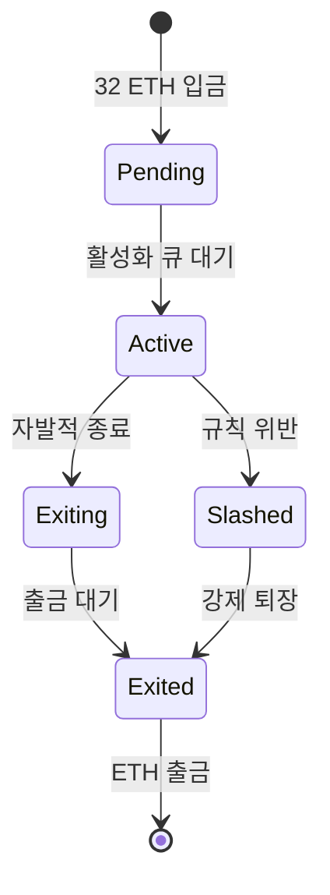
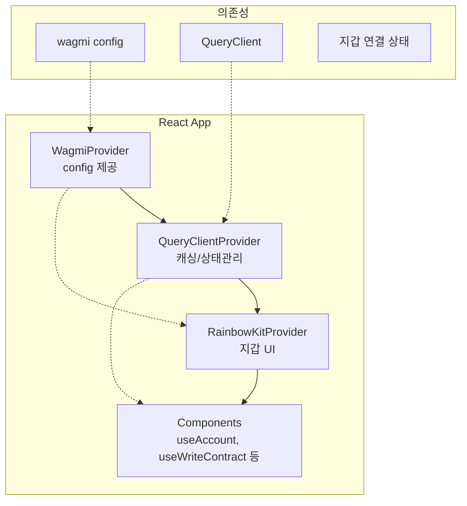

# Week 5 Quiz: PoS/Consensus + RainbowKit

**제출 방법:** 이 파일을 복사하여 답변을 작성한 후, PR로 제출하세요.
**평가 기준:** 개념 이해도 중심 - 문법 오류보다 논리적 설명을 중시합니다.

---

## 문제 1: PoS 개념 (객관식)

이더리움이 PoW(작업 증명)에서 PoS(지분 증명)로 전환한 **가장 주요한 이유**는 무엇인가요?

**보기:**
A) 트랜잭션 처리 속도를 10배 이상 높이기 위해
B) 에너지 소비를 99.95% 이상 줄이고 환경 친화적으로 만들기 위해
C) 블록 크기를 늘려서 더 많은 데이터를 저장하기 위해
D) 채굴 장비 없이도 누구나 블록을 생성할 수 있게 하기 위해

**답변:**
정답: B
이전의 증명 방식인 PoW(작업 증명)는 고성능 컴퓨팅 장비로 수학적 암호 해시의 어려운 퍼즐을 푸는 데 전 지구적으로 막대한 수준의 전력을 소모하면서 환경 오염 논란이 거셌습니다. PoS(지분 증명) 방식은 해시 연산 경쟁을 없애고 자본금(ETH 스테이킹)을 담보로 노드 참여 가중 권한을 증명하는 방식을 채택하여 에너지 막대 소비 문제를 기존 대비 99.95% 이상 획기적으로 줄여 친환경적인 지속 가능성을 확보했습니다.

---

## 문제 2: 검증자 역할 (객관식)

이더리움 PoS에서 검증자(Validator)가 수행하는 **두 가지 주요 역할**은 무엇인가요?

**보기:**
A) 블록 채굴(Mining)과 가스 가격 결정
B) 블록 제안(Proposing)과 블록 증명(Attesting)
C) 트랜잭션 전송과 수수료 수집
D) 스마트 컨트랙트 배포와 실행

**답변:**
정답: B
PoS의 검증자는 자신이 속한 슬롯 순서에 당첨이 되면 트랜잭션들을 모아 새로운 풀 블록을 만들어 네트워크에 최초로 퍼뜨리는 '제안자(Proposer)'의 역할을 합니다. 또한 다른 이가 만든 블록을 받았을 때 해당 데이터와 트랜잭션들이 타당한지 투표를 내려 증명해주는 '증명자(Attester)'의 역할 두 가지를 수행하며 네트워크 보안을 구축합니다.

---

## 문제 3: 왜 PoW에서 PoS로? (단답형)

PoW(작업 증명)와 PoS(지분 증명)의 **핵심 차이점**은 무엇인가요?
"자격 증명 방식"과 "보안 보장 방식" 두 관점에서 각각 비교하세요.

**답변:**
자격 증명 방식:
- PoW: 연산 속도가 뛰어난 값비싼 채굴용 하드웨어 장비를 구매하고 물리적 전기 에너지를 대거 소모하는 컴퓨팅 연산력으로 자격을 증명함.
- PoS: 이더리움 시스템 내부에 순수 자신의 자본인 일정량(32 ETH)을 묶고 시스템을 위해 리스크(스테이킹)를 담보하는 경제 지분율로 자격을 증명함.

보안 보장 방식:
- PoW: 51% 이상의 네트워크 공격을 감행하려면, 사실상 전 세계 네트워크 컴퓨팅 파워 절반 이상의 장비 및 전기료 자본을 무식하게 앞서 투입해야만 하므로 터무니없는 물리적/금전 비용 장벽으로 공격자를 방어함.
- PoS: 공격자가 나쁜 짓을 하다 들키면 자신의 유치된 담보 ETH가 즉시 네트워크상에서 소각 몰수(Slashing)되거나 시스템 붕괴로 보유 ETH 가치가 폭락하게 되는 등의 확실하고 직접적이며 파괴적인 경제 패널티를 부여해 공격 시도를 억제함.

---

## 문제 4: 슬래싱의 목적 (단답형)

슬래싱(Slashing)은 검증자의 스테이킹된 ETH를 **강제로 소각**하는 패널티입니다.

1) 슬래싱이 발동되는 **두 가지 조건**은 무엇인가요?
2) **왜** 이런 처벌이 필요한가요? 없다면 어떤 문제가 생길 수 있나요?

**답변:**
1) 슬래싱 조건 (2가지):
   - 한 슬롯에서 각기 다른 두 개의 블록(결과)들을 동시에 생성해 제안하는 경우 (Equivocation)
   - 나쁜 의도로 네트워크의 포크나 체인 규칙을 위반하는 이상/충돌 투표(예: Surround Vote 등)를 행사하는 경우

2) 슬래싱이 필요한 이유:
   PoS 환경에선 PoW처럼 해시 연산을 돌릴 때의 물리적 비용(비싼 전기세 등)이 1도 소모되지 않습니다(Nothing at Stake). 그러다 보니 만약 네트워크가 갈라지거나 블록을 무한 생성하더라도 전혀 페널티가 없다면 노드들은 이쪽 분기든 저쪽 분기든 밑져야 본전으로 모두 투표하여 네트워크 혼란을 부추기는 문제가 초래됩니다. 이를 막고자 악의적으로 룰을 어기는 행동에 대해서 강력한 물리적(스테이킹 지분율) 금전 압수 패널티를 가해 억지력을 제공합니다.

---

## 문제 5: 체인 선택 규칙 (단답형)

여러 유효한 블록이 동시에 제안되면 **포크(Fork)**가 발생합니다.
이더리움의 LMD-GHOST(Latest Message Driven GHOST) 규칙은 어떻게 "정규 체인"을 선택하나요?

1) LMD-GHOST의 기본 원리는 무엇인가요?
2) **왜** "가장 최근 메시지"를 사용하나요? (오래된 메시지를 사용하면 어떤 문제가?)

**답변:**
1) LMD-GHOST 원리:
   두 갈래 체인 분기가 생겼을 때, 트리를 탐색하며 각 노드(Validator)들의 투표 지분 가중치가 가장 폭넓게 많이 더해지고 쌓인 무거운(Heaviest) 쪽의 경로 트리를 정규 메인 체인으로 판별 채택하는 방식입니다.

2) 최근 메시지 사용 이유:
   검증자의 오프라인 상태나 예전거, 현재거 등 여러 분기점에서의 투표를 모두 동등하게 계산하면 복잡하고 악의적 번복(조작) 투표 등을 허용하게 되며 계산량이 무한히 폭주합니다. 따라서 항상 밸리데이터가 표명한 "유효한 가장 최신"의 메시지 1개만 유효하다고 간주해야 네트워크 합의 속도가 빠르고 메인 체인으로의 명확한 확정(지향성)을 강하게 유도할 수 있기 때문입니다.

---

## 문제 6: RainbowKit Provider 계층 (빈칸 채우기)

다음 코드의 빈칸을 채워서 RainbowKit을 올바르게 설정하세요.
**Provider 순서가 중요합니다!**

```typescript
'use client';

// TODO: 필요한 스타일 import
import '@rainbow-me/rainbowkit/styles.css';

import { RainbowKitProvider } from '@rainbow-me/rainbowkit';
import { WagmiProvider } from 'wagmi';
import { QueryClientProvider, QueryClient } from '@tanstack/react-query';
import { config } from '@/config/wagmi';

const queryClient = new QueryClient();

export default function RootLayout({ children }) {
  return (
    <html lang="ko">
      <body>
        {/* TODO: Provider를 올바른 순서로 중첩하세요 */}
        <WagmiProvider config={config}>
          <QueryClientProvider client={queryClient}>
            <RainbowKitProvider>
              {children}
            </RainbowKitProvider>
          </QueryClientProvider>
        </WagmiProvider>
      </body>
    </html>
  );
}
```

**왜 이 순서인가요:**
Wagmi 설정 정보가 최상위에 존재해야 내부에서 비동기 데이터 캐싱 계층인 React Query 인스턴스가 Wagmi 데이터를 다루게 되며, 그 가장 최종 하단 UI 라이브러리인 RainbowKit이 이 wagmi, Query 두 Provider에서 나오는 지갑/네트워크 컨텍스트 기능과 상태 데이터를 받아다 화면에 버튼 등을 정상적으로 그릴 수 있는 의존성 흐름이기 때문입니다. 순서가 위배되면 외부의 계층은 내부의 상태를 들여다보지 못합니다.

---

## 문제 7: Provider 순서 버그 (취약점 찾기)

다음 코드에서 **문제점**을 찾고 수정하세요:

```typescript
// BAD CODE - 문제점 찾기
'use client';

import '@rainbow-me/rainbowkit/styles.css';
import { RainbowKitProvider } from '@rainbow-me/rainbowkit';
import { WagmiProvider } from 'wagmi';
import { QueryClientProvider, QueryClient } from '@tanstack/react-query';
import { config } from '@/config/wagmi';

const queryClient = new QueryClient();

export default function Providers({ children }) {
  return (
    // 문제가 있는 Provider 순서!
    <QueryClientProvider client={queryClient}>
      <RainbowKitProvider>
        <WagmiProvider config={config}>
          {children}
        </WagmiProvider>
      </RainbowKitProvider>
    </QueryClientProvider>
  );
}
```

**1) 발견한 문제점:**
WagmiProvider가 가장 하위 자식 계층으로 깔려 있으며 QueryClient와 RainbowKit가 그 바깥 상위에 잘못 배치되어 의존성 컨텍스트 순서가 위배되었습니다.

**2) 왜 이것이 문제인가:**
이 순서대로라면 RainbowKitProvider 등 Wagmi 데이터가 필수적으로 조립되어야 하는 상단 레이어들은 아직 시작도 안 한 Wagmi 환경값(`config` 정보)의 Context를 상속받지 못한 백지로 동작 시도합니다. 때문에 내부 훅들의 작동 불능과 함께 "Cannot find WagmiContext" 같은 치명적 오류를 뿜어내며 전체 리액트 트리가 부서지고 애플리케이션 진입로가 깨져버리게 됩니다.

**3) 올바른 수정 방법:**
```typescript
// GOOD CODE - 수정된 버전을 작성하세요
export default function Providers({ children }) {
  return (
    <WagmiProvider config={config}>
      <QueryClientProvider client={queryClient}>
        <RainbowKitProvider>
          {children}
        </RainbowKitProvider>
      </QueryClientProvider>
    </WagmiProvider>
  );
}
```

---

## 문제 8: 트랜잭션 상태 처리 (빈칸 채우기)

다음 코드의 빈칸을 채워서 트랜잭션 전송 후 **확인 상태를 추적**하세요:

```typescript
'use client';

import { useWriteContract, useWaitForTransactionReceipt } from 'wagmi';

const abi = [ ... ] as const;

function IncrementButton() {
  const { writeContract, data: hash, isPending } = useWriteContract();

  // TODO: 트랜잭션 확인 상태를 추적하는 hook
  const { isLoading: isConfirming, isSuccess } = useWaitForTransactionReceipt({
    hash,
  });

  return (
    <div>
      <button
        onClick={() =>
          writeContract({
            address: '0x1234...5678',
            abi,
            functionName: 'increment',
          })
        }
        disabled={isPending || isConfirming}
      >
        {isPending ? '서명 대기 중...' : isConfirming ? '확인 중...' : '증가'}
      </button>

      {isSuccess && <p>트랜잭션 성공!</p>}
    </div>
  );
}
```

**트랜잭션 상태 흐름을 설명하세요:**
1) isPending 상태: 사용자가 서명 버튼을 누른 후 메타마스크나 외부 지갑 팝업을 열어 검토하고, 블록체인 노드로의 데이터를 최종 발송 승인하기 위해 기다리고 있는 프론트엔드 환경의 준비/대기 단계입니다.
2) isConfirming 상태: 이미 네트워크에 제출 발송이 완료된 트랜잭션이 아직 블록체인 물리적 장부에 온전히 작성(채굴)되지 못해 멤풀 등을 거치며 '확인'을 기다리는 네트워크 연동 소모/동기화 기간입니다.
3) isSuccess 상태: 최종 블록에 해당 트랜잭션의 결과가 모두 검증 완료되어 문제없이 Receipt(영수증)가 발급된 성공적인 완전 승인 상태입니다.

---

## 문제 9: 검증자 생애주기 (다이어그램 해석)

다음 다이어그램은 이더리움 검증자의 생애주기를 보여줍니다:



**질문:**

1) **Active** 상태에서 검증자가 수행하는 주요 활동은 무엇인가요?
   - 활성 검증자가 모여 정해진 슬롯 타임마다 이더리움 메인넷 체인을 이끌어갈 "새로운 블록의 제안(Proposing)" 및 타블록 "규칙 위반 투표 검증(Attesting)" 작업을 지속적으로 반복 수행하고 그 대가 합의 보상(수익)을 벌어들입니다.

2) Active에서 **Slashed**로 전이되는 조건은 무엇인가요? 이 경우 검증자에게 어떤 일이 발생하나요?
   - 규칙 위반인 중복(기만)투표/이중 블록 생성 등 심각한 네트워크 해악 행위를 저질렀을 경우가 조건입니다. 이때 즉시 적발되어 예치해둔 32개 ETH에 치명적인 금액적 강제 압수/소각 페널티가 내려지며 활성 검증 권한을 바로 그 자리에서 박탈당하고 추방 대기(강제 퇴장) 상태로 직행하게 됩니다.

3) 검증자가 자발적으로 종료(**Exiting**)하려면 왜 바로 ETH를 출금할 수 없고 대기 기간이 필요한가요?
   - 특정 시간대에 수천~수만 개의 대규모 밸리데이터가 갑자기 지분을 동시에 빼버리고 대거 이탈하는 뱅크런(Bank run) 공격이 발생하면 블록체인 전체 시스템의 처리 합의와 보안을 지탱하는 기반이 순식간에 붕괴되기 때문입니다. 이를 막기 위해 한 턴에 빠질 수 있는 큐(Queue)를 제한하여 안전하게 빠져나갈 유예 장치를 의무적으로 마련해야 합니다.

---

## 문제 10: Provider 계층 구조 (다이어그램 해석)

다음 다이어그램은 RainbowKit/wagmi 앱의 Provider 구조를 보여줍니다:



**질문:**

1) **WagmiProvider**가 가장 바깥에 있어야 하는 이유는 무엇인가요?
   - React 애플리케이션 트리 구조에서 전체 시스템이 소통할 블록체인 네트워크 정보 및 연결 어댑터 지식인 환경 변수값(`config`)이 모든 계층 컨텍스트의 밑바탕이 되어야 하기 때문입니다. 부모가 이 지식을 들고 아래 자식 노드들에게 전파해 주어야 자식들이 이것을 의존성 삼아 그 뒤의 로직을 문제없이 수행할 수 있습니다.

2) **QueryClientProvider**의 역할은 무엇인가요? 없다면 어떤 문제가 발생하나요?
   - Wagmi가 블록체인과 통신하며 가져온 비동기 잔액이나 네트워크/지갑 로딩 상태값들을 실시간으로 효율 저장 캐싱하고 UI 컴포넌트 생명 주기에 따라 렌더링에 사용할 수 있도록 상태 관리를 전담하는 그릇의 역할입니다. 없다면 외부 통신 데이터들을 저장하고 비동기적으로 `isPending` 따위로 제어해 내보낼 내부 시스템이 소멸하므로 자식 훅들이 모조리 에러 크래시를 발생시키며 고장 납니다.

3) 아래 코드에서 `useAccount()` hook이 **"Cannot find WagmiContext"** 오류를 발생시키는 이유는 무엇인가요?
   - 컴포넌트 마운팅 흐름 위쪽(`WagmiProvider` 외부 영역)에 `QueryClientProvider`나 `RainbowKit`이 위치하기 때문에 이 부모들은 정작 자식인 wagmi 인스턴스로부터 자신들이 필요로 하는 `WagmiContext` 컨텍스트 환경값을 공급받지 못한 채 고장 나버리기 때문입니다 (부모는 자식의 컨텍스트를 들여다볼 수 없음). 
