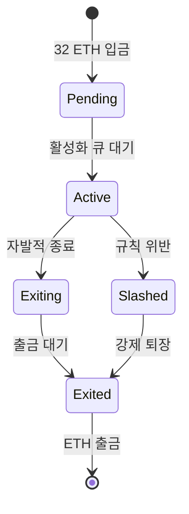
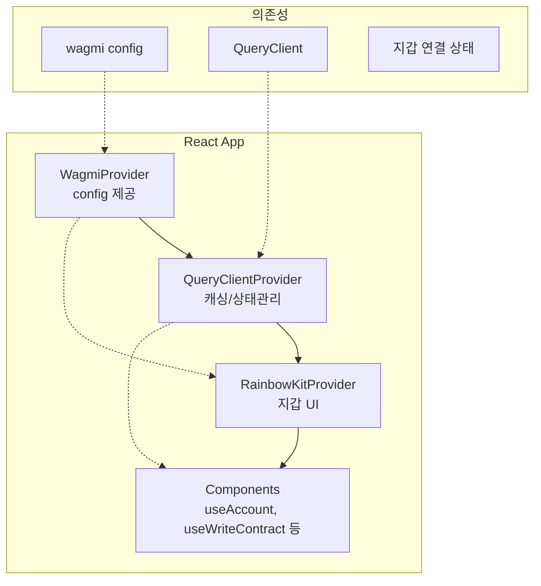

# Week 5 Quiz: PoS/Consensus + RainbowKit

> **제출 방법:** 이 파일을 복사하여 답변을 작성한 후, PR로 제출하세요.
> **평가 기준:** 개념 이해도 중심 - 문법 오류보다 논리적 설명을 중시합니다.

---

## 문제 1: PoS 개념 (객관식)

이더리움이 PoW(작업 증명)에서 PoS(지분 증명)로 전환한 **가장 주요한 이유**는 무엇인가요?

**보기:**
A) 트랜잭션 처리 속도를 10배 이상 높이기 위해
B) 에너지 소비를 99.95% 이상 줄이고 환경 친화적으로 만들기 위해
C) 블록 크기를 늘려서 더 많은 데이터를 저장하기 위해
D) 채굴 장비 없이도 누구나 블록을 생성할 수 있게 하기 위해

**답변:**

**정답: B**

PoW는 채굴자(Miner)들이 SHA-256 해시 퍼즐을 풀기 위해 막대한 연산을 수행해야 했고, 이 과정에서 전 세계적으로 소규모 국가 수준의 전력을 소비했습니다. 이더리움 재단은 이를 가장 심각한 문제로 보고 "The Merge(머지)"를 통해 PoS로 전환했습니다.

- **PoW의 문제**: 블록 생성 자격을 얻기 위해 무의미한 수학 계산(해시 반복)을 경쟁적으로 수행 → 막대한 전력 낭비
- **PoS의 해결책**: 블록 생성 자격을 32 ETH를 스테이킹(담보로 예치)한 검증자에게 부여 → 연산 없이 선출되므로 에너지 소비가 99.95% 이상 감소

A(속도 향상)는 PoS 전환의 직접적인 목적이 아니며, C/D는 부수적이거나 잘못된 설명입니다.

---

## 문제 2: 검증자 역할 (객관식)

이더리움 PoS에서 검증자(Validator)가 수행하는 **두 가지 주요 역할**은 무엇인가요?

**보기:**
A) 블록 채굴(Mining)과 가스 가격 결정
B) 블록 제안(Proposing)과 블록 증명(Attesting)
C) 트랜잭션 전송과 수수료 수집
D) 스마트 컨트랙트 배포와 실행

**답변:**

**정답: B**

이더리움 PoS에서 검증자(Validator)의 두 가지 주요 역할은 다음과 같습니다:

1. **블록 제안(Block Proposing)**: 슬롯(12초)마다 무작위로 선택된 단 한 명의 검증자가 새로운 블록을 구성하여 네트워크에 제안합니다. 이 검증자는 미결 트랜잭션을 모아 블록을 만들고 서명하여 브로드캐스트합니다.

2. **블록 증명(Block Attesting)**: 나머지 검증자들은 위원회(Committee)를 구성하여 제안된 블록이 유효한지 검증하고 투표(Attestation)합니다. 자신의 투표를 서명하여 제출함으로써 블록의 정당성을 보증합니다.

A의 "채굴"은 PoW 개념이며 PoS에는 없습니다. C/D는 검증자의 역할이 아닙니다.

---

## 문제 3: 왜 PoW에서 PoS로? (단답형)

PoW(작업 증명)와 PoS(지분 증명)의 **핵심 차이점**은 무엇인가요?
"자격 증명 방식"과 "보안 보장 방식" 두 관점에서 각각 비교하세요.

**답변:**

**자격 증명 방식:**
- **PoW**: 블록 생성 자격을 얻으려면 가장 먼저 SHA-256 해시 퍼즐을 풀어야 합니다. 즉, **계산 능력(해시파워)** 을 증명함으로써 블록 제안 권한을 획득합니다. 더 많은 GPU/ASIC을 보유할수록 유리합니다.
- **PoS**: 블록 생성 자격은 **32 ETH를 네트워크에 스테이킹(예치)** 한 검증자 중 무작위로 선출됩니다. 즉, 자산(지분)을 예치했다는 사실 자체가 자격 증명이며, 과도한 연산 경쟁이 필요 없습니다.

**보안 보장 방식:**
- **PoW**: 네트워크를 공격(51% 공격)하려면 전체 해시파워의 51% 이상의 물리적 채굴 장비가 필요합니다. 장비 구입 비용과 전력 비용이 보안 장벽 역할을 합니다.
- **PoS**: 네트워크를 공격하려면 전체 스테이킹된 ETH의 51% 이상을 보유해야 합니다. 공격 시도가 감지되면 해당 ETH가 **슬래싱(소각)** 되므로, 공격자가 직접적인 경제적 손실을 입습니다. 공격 자체가 자기 자산을 파괴하는 행위가 됩니다.

---

## 문제 4: 슬래싱의 목적 (단답형)

슬래싱(Slashing)은 검증자의 스테이킹된 ETH를 **강제로 소각**하는 패널티입니다.

1) 슬래싱이 발동되는 **두 가지 조건**은 무엇인가요?
2) **왜** 이런 처벌이 필요한가요? 없다면 어떤 문제가 생길 수 있나요?

**답변:**

**1) 슬래싱 조건 (2가지):**
- **이중 제안(Double Proposing / Equivocation)**: 같은 슬롯(블록 높이)에서 동일한 검증자가 서로 다른 두 개의 블록을 동시에 제안하는 행위. 네트워크를 포크시키기 위한 의도적 악의 행위로 간주됩니다.
- **이중 투표(Double Voting / Surround Voting)**: 같은 슬롯에서 두 개의 상충된 블록에 동시에 증명(Attestation) 투표하거나, 기존 체크포인트를 감싸는(surround) 방식으로 과거를 되돌리려는 투표를 하는 행위.

**2) 슬래싱이 필요한 이유:**

슬래싱이 없다면 검증자는 아무런 경제적 위험 없이 악의적 행동을 시도할 수 있습니다. 예를 들어, 이중 블록 제안으로 네트워크를 포크시키거나, 이중 투표로 합의를 방해하더라도 잃을 것이 없습니다. PoS의 보안은 "공격하면 자신의 스테이킹 ETH를 잃는다"는 **경제적 억지력(Economic Deterrence)** 에 의존합니다. 슬래싱이 없으면 이 억지력이 사라져 검증자들이 합의를 방해해도 오히려 이익을 얻는 상황(Nothing-at-stake 문제)이 발생합니다.

---

## 문제 5: 체인 선택 규칙 (단답형)

여러 유효한 블록이 동시에 제안되면 **포크(Fork)**가 발생합니다.
이더리움의 LMD-GHOST(Latest Message Driven GHOST) 규칙은 어떻게 "정규 체인"을 선택하나요?

1) LMD-GHOST의 기본 원리는 무엇인가요?
2) **왜** "가장 최근 메시지"를 사용하나요? (오래된 메시지를 사용하면 어떤 문제가?)

**답변:**

**1) LMD-GHOST 원리:**

LMD-GHOST는 포크가 발생했을 때 어느 체인이 정규 체인인지를 결정하는 알고리즘입니다. 제네시스(genesis) 블록부터 시작하여 각 분기점(fork)에서 **가장 많은 검증자 투표(Attestation)를 받은 가지(branch)를 선택**해 나갑니다. 이때 각 검증자의 **가장 최근 투표(Latest Message)만** 유효한 가중치로 계산합니다. 즉, 모든 검증자의 누적 투표가 아니라 각 검증자당 최신 1표만 집계하여 가장 무거운 서브트리를 따라갑니다.

**2) 최근 메시지 사용 이유:**

오래된 메시지(과거 투표)까지 누적 계산하면 **검증자의 현재 의도가 반영되지 않습니다**. 예를 들어 검증자가 이전에 포크 체인 A에 투표했다가 후에 마음을 바꿔 체인 B에 투표했다면, 두 투표를 모두 계산하면 A와 B 양쪽 모두에 영향을 미치게 됩니다. 이렇게 되면 **오래된 투표가 현재 합의를 왜곡**하고 롱레인지 공격(Long-Range Attack)에 취약해집니다. 반면 최신 메시지만 사용하면 검증자의 현재 판단이 체인 선택에 정확히 반영되어 보다 빠르고 안정적인 합의 수렴이 가능합니다.

---

## 문제 6: RainbowKit Provider 계층 (빈칸 채우기)

다음 코드의 빈칸을 채워서 RainbowKit을 올바르게 설정하세요.
**Provider 순서가 중요합니다!**

```typescript
'use client';

// TODO: 필요한 스타일 import
_________________________________________

import { RainbowKitProvider } from '@rainbow-me/rainbowkit';
import { WagmiProvider } from 'wagmi';
import { QueryClientProvider, QueryClient } from '@tanstack/react-query';
import { config } from '@/config/wagmi';

const queryClient = new QueryClient();

export default function RootLayout({ children }) {
  return (
    <html lang="ko">
      <body>
        {/* TODO: Provider를 올바른 순서로 중첩하세요 */}
        <_________________ config={config}>
          <_________________ client={queryClient}>
            <_________________>
              {children}
            </_________________>
          </_________________>
        </_________________>
      </body>
    </html>
  );
}
```

**답변:**
```typescript
'use client';

import '@rainbow-me/rainbowkit/styles.css';

import { RainbowKitProvider } from '@rainbow-me/rainbowkit';
import { WagmiProvider } from 'wagmi';
import { QueryClientProvider, QueryClient } from '@tanstack/react-query';
import { config } from '@/config/wagmi';

const queryClient = new QueryClient();

export default function RootLayout({ children }) {
  return (
    <html lang="ko">
      <body>
        <WagmiProvider config={config}>
          <QueryClientProvider client={queryClient}>
            <RainbowKitProvider>
              {children}
            </RainbowKitProvider>
          </QueryClientProvider>
        </WagmiProvider>
      </body>
    </html>
  );
}
```

**왜 이 순서인가요:**

Provider는 React Context의 중첩 구조이므로 **안쪽 Provider가 바깥쪽 Provider의 Context에 의존**합니다.

- **WagmiProvider가 가장 바깥**: wagmi의 체인 설정(config)을 모든 하위 컴포넌트에 제공합니다. `QueryClientProvider`와 `RainbowKitProvider` 모두 wagmi context가 필요하므로 반드시 최상위에 위치해야 합니다.
- **QueryClientProvider가 중간**: React Query의 캐싱/비동기 상태 관리를 제공합니다. wagmi의 `useReadContract` 등의 훅이 내부적으로 React Query를 사용하므로 wagmi보다 안쪽에 위치합니다. RainbowKit도 데이터 페칭에 React Query를 사용하므로 RainbowKitProvider보다 바깥에 있어야 합니다.
- **RainbowKitProvider가 가장 안쪽**: 지갑 연결 UI를 제공하며, wagmi context와 React Query context를 모두 필요로 합니다.

순서가 잘못되면 예를 들어 `WagmiProvider`를 안쪽에 두면 `RainbowKitProvider`가 초기화될 때 wagmi context를 찾지 못해 **"No WagmiProvider found"** 오류가 발생합니다.

---

## 문제 7: Provider 순서 버그 (취약점 찾기)

다음 코드에서 **문제점**을 찾고 수정하세요:

```typescript
// BAD CODE - 문제점 찾기
'use client';

import '@rainbow-me/rainbowkit/styles.css';
import { RainbowKitProvider } from '@rainbow-me/rainbowkit';
import { WagmiProvider } from 'wagmi';
import { QueryClientProvider, QueryClient } from '@tanstack/react-query';
import { config } from '@/config/wagmi';

const queryClient = new QueryClient();

export default function Providers({ children }) {
  return (
    // 문제가 있는 Provider 순서!
    <QueryClientProvider client={queryClient}>
      <RainbowKitProvider>
        <WagmiProvider config={config}>
          {children}
        </WagmiProvider>
      </RainbowKitProvider>
    </QueryClientProvider>
  );
}
```

**1) 발견한 문제점:**

Provider 순서가 완전히 뒤집혀 있습니다. `WagmiProvider`가 가장 안쪽에 있고, `RainbowKitProvider`가 `WagmiProvider`보다 바깥에 배치되어 있습니다.

정상적인 순서는 `WagmiProvider → QueryClientProvider → RainbowKitProvider` 이어야 합니다. 현재 코드는 `RainbowKitProvider`가 `WagmiProvider`보다 먼저(바깥에) 렌더링되므로, `RainbowKitProvider` 초기화 시점에 wagmi context가 존재하지 않습니다.

**2) 왜 이것이 문제인가:**

`RainbowKitProvider`는 내부적으로 wagmi의 context(`WagmiProvider`가 제공)와 React Query의 context(`QueryClientProvider`가 제공)에 접근합니다. 현재 코드에서는 `RainbowKitProvider`가 `WagmiProvider`보다 바깥에 위치하므로, `RainbowKitProvider`가 렌더링될 때 wagmi context가 아직 존재하지 않습니다. 이로 인해 **"WagmiProviderNotFoundError"** 또는 **"No WagmiContext found"** 런타임 오류가 발생하며 앱이 정상적으로 작동하지 않습니다.

**3) 올바른 수정 방법:**
```typescript
'use client';

import '@rainbow-me/rainbowkit/styles.css';
import { RainbowKitProvider } from '@rainbow-me/rainbowkit';
import { WagmiProvider } from 'wagmi';
import { QueryClientProvider, QueryClient } from '@tanstack/react-query';
import { config } from '@/config/wagmi';

const queryClient = new QueryClient();

export default function Providers({ children }) {
  return (
    // GOOD CODE: WagmiProvider → QueryClientProvider → RainbowKitProvider
    <WagmiProvider config={config}>
      <QueryClientProvider client={queryClient}>
        <RainbowKitProvider>
          {children}
        </RainbowKitProvider>
      </QueryClientProvider>
    </WagmiProvider>
  );
}
```

---

## 문제 8: 트랜잭션 상태 처리 (빈칸 채우기)

다음 코드의 빈칸을 채워서 트랜잭션 전송 후 **확인 상태를 추적**하세요:

```typescript
'use client';

import { useWriteContract, _________________ } from 'wagmi';

const abi = [
  {
    name: 'increment',
    type: 'function',
    stateMutability: 'nonpayable',
    inputs: [],
    outputs: [],
  },
] as const;

function IncrementButton() {
  const { writeContract, data: hash, isPending } = useWriteContract();

  // TODO: 트랜잭션 확인 상태를 추적하는 hook
  const { isLoading: isConfirming, isSuccess } = _________________({\
    _________________,
  });

  return (
    <div>
      <button
        onClick={() =>
          writeContract({
            address: '0x1234...5678',
            abi,
            functionName: 'increment',
          })
        }
        disabled={isPending || isConfirming}
      >
        {isPending ? '서명 대기 중...' : isConfirming ? '확인 중...' : '증가'}
      </button>

      {isSuccess && <p>트랜잭션 성공!</p>}
    </div>
  );
}
```

**답변:**
```typescript
'use client';

import { useWriteContract, useWaitForTransactionReceipt } from 'wagmi';

const abi = [
  {
    name: 'increment',
    type: 'function',
    stateMutability: 'nonpayable',
    inputs: [],
    outputs: [],
  },
] as const;

function IncrementButton() {
  const { writeContract, data: hash, isPending } = useWriteContract();

  // 트랜잭션 확인 상태를 추적하는 hook
  const { isLoading: isConfirming, isSuccess } = useWaitForTransactionReceipt({
    hash,
  });

  return (
    <div>
      <button
        onClick={() =>
          writeContract({
            address: '0x1234...5678',
            abi,
            functionName: 'increment',
          })
        }
        disabled={isPending || isConfirming}
      >
        {isPending ? '서명 대기 중...' : isConfirming ? '확인 중...' : '증가'}
      </button>

      {isSuccess && <p>트랜잭션 성공!</p>}
    </div>
  );
}
```

**트랜잭션 상태 흐름을 설명하세요:**

1) **isPending 상태**: 사용자가 버튼을 클릭하여 `writeContract()`가 호출된 후, 사용자가 MetaMask 등 지갑에서 트랜잭션에 **서명(Sign)하기를 기다리는 상태**입니다. 아직 트랜잭션이 네트워크로 전송되지 않은 단계입니다.

2) **isConfirming 상태**: 사용자가 지갑에서 서명을 완료하여 트랜잭션이 **네트워크에 브로드캐스트된 후**, 채굴자(또는 검증자)에 의해 블록에 포함되기를 **기다리는 상태**입니다. `useWaitForTransactionReceipt`가 주기적으로 트랜잭션 영수증(Receipt)을 조회하며 확인 중일 때 `isLoading: true`가 됩니다.

3) **isSuccess 상태**: 트랜잭션이 블록에 포함되어 **트랜잭션 영수증(Receipt)이 반환된 상태**입니다. 트랜잭션이 성공적으로 실행되었음을 의미하며, `isSuccess: true`가 되어 "트랜잭션 성공!" 메시지를 표시합니다.

---

## 문제 9: 검증자 생애주기 (다이어그램 해석)

다음 다이어그램은 이더리움 검증자의 생애주기를 보여줍니다:



**질문:**

1) **Active** 상태에서 검증자가 수행하는 주요 활동은 무엇인가요?

Active 상태의 검증자는 매 에포크(Epoch, 32 슬롯 = 약 6.4분)마다 두 가지 역할을 수행합니다. 첫째, **블록 제안자(Proposer)** 로 무작위 선출되면 새로운 블록을 구성하고 서명하여 네트워크에 제안합니다. 둘째, 선출되지 않은 경우 **블록 증명자(Attester)** 로서 제안된 블록의 유효성을 검증하고 투표(Attestation)를 제출합니다. 이 역할을 성실히 수행하면 보상(ETH)을 받고, 오프라인이거나 무응답이면 소액 패널티(Inactivity Penalty)를 받습니다.


2) Active에서 **Slashed**로 전이되는 조건은 무엇인가요? 이 경우 검증자에게 어떤 일이 발생하나요?

악의적인 행위인 **이중 제안(같은 슬롯에 두 개의 블록 제안)** 또는 **이중 투표/서라운드 투표(상충되는 두 개의 Attestation 제출)** 가 감지될 때 슬래시됩니다. 슬래싱이 발생하면 즉시 스테이킹 ETH의 최소 1/32이 소각되고, 강제로 종료(Exiting) 대기열에 들어갑니다. 더불어 **코릴레이션 패널티(Correlation Penalty)** 가 적용되어 같은 시기에 슬래시된 검증자가 많을수록 추가 삭감 비율이 높아집니다. 최악의 경우 스테이킹 ETH의 상당 부분이 소각됩니다.


3) 검증자가 자발적으로 종료(**Exiting**)하려면 왜 바로 ETH를 출금할 수 없고 대기 기간이 필요한가요?

대기 기간(약 27시간~수일)은 두 가지 이유 때문에 필요합니다. 첫째, **보안상의 이유**로 종료 신청 후 즉시 출금이 가능하면 악의적 검증자가 공격을 수행한 직후 ETH를 빼내 슬래싱을 피할 수 있습니다. 대기 기간 동안 다른 노드들이 해당 검증자의 과거 행위를 검토하고 슬래싱을 제출할 수 있습니다. 둘째, **네트워크 안정성**을 위해 너무 많은 검증자가 동시에 탈퇴하면 스테이킹 총량이 급감하여 보안이 약화될 수 있습니다. 따라서 탈퇴 큐(Exit Queue)를 통해 검증자가 순차적으로 나가도록 제한합니다.


---

## 문제 10: Provider 계층 구조 (다이어그램 해석)

다음 다이어그램은 RainbowKit/wagmi 앱의 Provider 구조를 보여줍니다:



**질문:**

1) **WagmiProvider**가 가장 바깥에 있어야 하는 이유는 무엇인가요?

`WagmiProvider`는 wagmi의 `config`(체인 정보, 커넥터, RPC URL 등)를 **React Context를 통해 하위 모든 컴포넌트에 제공**합니다. `QueryClientProvider`는 wagmi 내부 데이터 페칭에 React Query를 사용하므로 wagmi context 위에서 작동해야 하고, `RainbowKitProvider`는 wallets 목록과 연결 상태를 wagmi를 통해 관리합니다. 모든 하위 Provider와 컴포넌트가 wagmi context에 의존하기 때문에 `WagmiProvider`가 반드시 최상위(가장 바깥)에 위치해야 합니다. 만약 안쪽에 있으면 `RainbowKitProvider`나 `useAccount` 등의 훅이 wagmi context에 접근하지 못해 오류가 발생합니다.


2) **QueryClientProvider**의 역할은 무엇인가요? 없다면 어떤 문제가 발생하나요?

`QueryClientProvider`는 **TanStack Query(React Query)의 캐싱, 비동기 상태 관리, 백그라운드 리페칭** 기능을 앱 전체에 제공합니다. wagmi의 `useReadContract`, `useBalance` 등의 데이터 읽기 훅들은 내부적으로 React Query를 사용하여 온체인 데이터를 캐싱하고 자동 갱신합니다. `QueryClientProvider`가 없으면 wagmi 훅들이 React Query의 `QueryClient` 인스턴스를 찾지 못해 **"No QueryClient set, use QueryClientProvider to set one"** 오류가 발생하며, 모든 데이터 읽기/쓰기 기능이 작동하지 않습니다.


3) 아래 코드에서 `useAccount()` hook이 **"Cannot find WagmiContext"** 오류를 발생시키는 이유는 무엇인가요?

```typescript
// 오류 발생 코드
<QueryClientProvider>
  <RainbowKitProvider>
    <WagmiProvider>  {/* WagmiProvider가 안쪽에 있음 */}
      <MyComponent />  {/* useAccount() 호출 */}
    </WagmiProvider>
  </RainbowKitProvider>
</QueryClientProvider>
```

이 코드에서 `useAccount()`가 호출되는 `<MyComponent />`는 `WagmiProvider` 내부에 있으므로 표면상 문제가 없어 보입니다. 그러나 실제 오류 원인은 **`RainbowKitProvider`가 `WagmiProvider`보다 바깥에 있기 때문**입니다. `RainbowKitProvider`는 렌더링 시점에 wagmi context에 접근하여 지갑 연결 상태와 체인 정보를 읽으려 합니다. 하지만 이 시점에 `WagmiProvider`는 `RainbowKitProvider` 안쪽에 있으므로 아직 context를 제공하지 않은 상태입니다. React의 Context는 **부모→자식 방향으로만 전달**되므로 형제 또는 자식 Provider의 context를 부모 레벨에서 사용할 수 없습니다. 결과적으로 `RainbowKitProvider` 초기화 시 wagmi context 접근에 실패하여 "Cannot find WagmiContext" 오류가 발생합니다.

---

## 제출 전 체크리스트

- [x] 모든 문제에 답변을 작성했는가?
- [x] 객관식 문제: 정답 선택 **이유**를 설명했는가?
- [x] 단답형 문제: 2-3문장 이상으로 충분히 설명했는가?
- [x] 코드 문제: 완성된 코드와 **왜 그렇게 작성했는지** 설명했는가?
- [x] 다이어그램 문제: 각 질문에 논리적으로 답변했는가?
