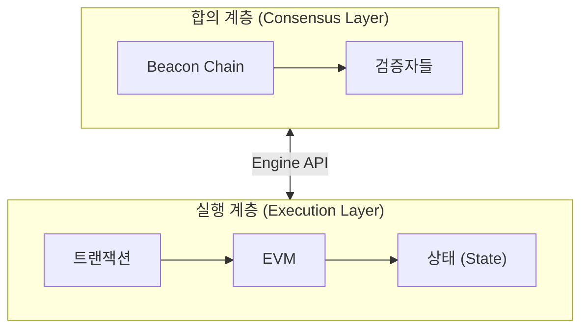
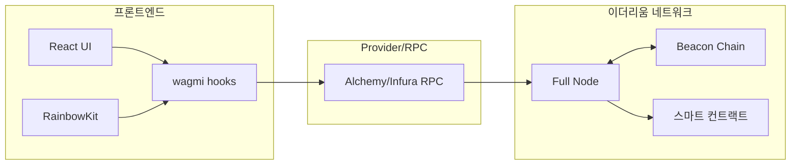

# Week 6 Quiz: Beacon Chain/Finality + Final Project Integration

> **제출 방법:** 이 파일을 복사하여 답변을 작성한 후, PR로 제출하세요.
> **평가 기준:** 개념 이해도 중심 - 6주간 배운 내용을 **통합**하여 설명하세요.

---

## 문제 1: Beacon Chain 역할 (객관식)

Beacon Chain의 **주요 역할**은 무엇인가요?

**보기:**
A) 스마트 컨트랙트를 실행하고 상태를 관리한다
B) 검증자를 관리하고 합의를 조정하며 블록 최종성을 결정한다
C) 트랜잭션 수수료를 계산하고 분배한다
D) 사용자의 지갑을 생성하고 개인키를 관리한다

**답변:**

**정답: B**

Beacon Chain은 이더리움의 **합의 계층(Consensus Layer)** 으로서, 검증자(Validator)들을 등록·관리하고, 누가 언제 블록을 제안·검증할지 조율하며, Casper FFG를 통해 블록의 최종성(Finality)을 결정하는 역할을 합니다.

이와 달리 **실행 계층(Execution Layer, EL)** 은 트랜잭션을 실제로 실행하고 EVM을 통해 스마트 컨트랙트를 구동하며 상태(State)를 관리합니다. A는 EL의 역할이며, C·D는 어느 계층에도 해당하지 않습니다.

---

## 문제 2: Finality 개념 (객관식)

이더리움에서 **Finality(최종성)**가 달성되면 어떤 상태인가요?

**보기:**
A) 트랜잭션이 mempool에 들어간 상태
B) 블록이 체인에 추가되었지만 아직 재조직(reorg)될 수 있는 상태
C) 전체 검증자의 1/3 이상이 슬래싱되지 않는 한 절대 변경되지 않는 상태
D) 24시간이 지나서 트랜잭션이 만료된 상태

**답변:**

**정답: C**

Finality가 달성된다는 것은 Casper FFG 규칙상 해당 체크포인트가 **Finalized** 상태가 되었음을 의미합니다. 이 상태에서 블록을 되돌리려면 전체 검증자 지분(Stake)의 **1/3 이상이 슬래싱(Slashing)** 되어야만 가능합니다.

1/3이 조건인 이유는 Casper FFG가 **BFT(Byzantine Fault Tolerant) 기반**이기 때문입니다. 2/3 이상의 검증자가 동의해야 최종화가 되므로, 이를 뒤집으려면 2/3를 새로운 체인으로 옮겨야 하는데 그러면 기존 투표와 충돌하는 1/3 이상이 슬래싱됩니다. 즉, 공격 비용이 수십억 달러 규모의 ETH 손실로 이어지므로 경제적으로 공격이 사실상 불가능합니다.

Finality는 블록 재조직(reorg)이 경제적으로 불가능한 강한 보장을 제공하기 때문에, 거래소·dApp·브릿지 모두 Finality 이후 정산을 신뢰할 수 있게 됩니다.

---

## 문제 3: 왜 Finality가 중요한가 (단답형)

거래소나 dApp 개발자에게 **Finality**가 왜 중요한가요?
다음 시나리오를 예로 들어 설명하세요:

> 사용자가 거래소에 100 ETH를 입금하고, 거래소가 확인 후 내부 잔액에 반영했습니다.
> 그런데 나중에 블록 재조직(reorg)이 발생하여 입금 트랜잭션이 사라졌습니다.

**답변:**

**1) 위 시나리오에서 거래소에 어떤 문제가 발생하나요?**

거래소는 내부 DB에 100 ETH를 입금 처리했으나, reorg로 인해 해당 트랜잭션이 체인에서 제거되어 실제로는 ETH를 받지 못한 상태가 됩니다. 사용자가 이미 내부 잔액을 이용해 출금하거나 거래를 완료했다면, 거래소는 존재하지 않는 ETH를 지출한 셈이 되어 **100 ETH 손실**이 발생합니다. 이를 이중 지출(Double Spend) 공격으로 악용할 수도 있습니다.

**2) Finality가 있으면 이 문제가 어떻게 해결되나요?**

Finality가 확정된 블록에 포함된 입금 트랜잭션은 경제적으로 되돌릴 수 없습니다. 거래소는 Finality가 달성된 것을 확인한 후 내부 잔액을 반영하면, reorg 가능성이 원천적으로 차단되어 안전하게 정산을 처리할 수 있습니다.

**3) 이더리움에서 Finality까지 얼마나 기다려야 하나요?**

1 Slot = 12초, 1 Epoch = 32 Slots = 약 6.4분입니다. Casper FFG는 연속 두 Epoch의 체크포인트(Source → Target)가 2/3 이상의 검증자로부터 Attestation을 받아야 Finality를 달성합니다. 따라서 일반적으로 **약 2 Epoch(약 12~13분)** 후에 Finality가 확정됩니다.

---

## 문제 4: 포크 선택 규칙 (단답형)

이더리움은 **Casper FFG**와 **LMD-GHOST** 두 가지 메커니즘을 결합합니다.
각각의 역할은 무엇이며, **왜** 둘 다 필요한가요?

**답변:**

**1) Casper FFG의 역할:**

Casper FFG(Friendly Finality Gadget)는 **Epoch 단위의 최종성(Finality)** 을 제공합니다. 검증자들이 매 Epoch마다 체크포인트(Epoch 경계 블록)에 Attestation을 투표하고, 2/3 이상의 지지를 받은 체크포인트 쌍이 Justified → Finalized됩니다. 한번 Finalized된 블록은 경제적으로 취소 불가능합니다.

**2) LMD-GHOST의 역할:**

LMD-GHOST(Latest Message Driven Greedy Heaviest Observed SubTree)는 **Slot 단위의 현재 최선 체인(canonical chain)** 을 선택하는 포크 선택 알고리즘입니다. 각 검증자의 가장 최근 Attestation 메시지만 참고하여, 누적 검증자 지지 무게가 가장 무거운 서브트리를 정규 체인으로 선택합니다.

**3) 왜 둘 다 필요한가:**

- **LMD-GHOST만 있을 경우:** 포크 선택은 잘 되지만 Finality가 없어 블록이 이론적으로 언제든 reorg될 수 있습니다. 거래소나 dApp이 언제 트랜잭션을 확정으로 처리해야 할지 알 수 없어 장기 보안을 보장할 수 없습니다.
- **Casper FFG만 있을 경우:** Epoch 단위의 느린 주기에 의존하므로 매 Slot마다 어떤 블록이 정규 체인인지 빠르게 결정하는 메커니즘이 없어 네트워크가 일시적인 포크 상황에서 마비될 수 있습니다.
- **둘의 결합(Gasper):** LMD-GHOST가 매 12초마다 이후 체인을 결정하고, Casper FFG가 ~12분마다 체크포인트에 불가역적 최종성을 부여하여 **빠른 응답성 + 강한 보안** 을 동시에 달성합니다.

---

## 문제 5: dApp 아키텍처 설계 (코드/아키텍처 문제)

당신은 "간단한 투표 dApp"을 만들려고 합니다.
다음 요구사항을 읽고 **컴포넌트 구조**와 **사용할 hook**들을 설계하세요.

**요구사항:**
- 사용자가 지갑을 연결할 수 있다
- 현재 투표 현황(찬성/반대 수)을 조회할 수 있다
- 사용자가 찬성 또는 반대 투표를 할 수 있다
- 투표 후 결과가 화면에 즉시 반영된다

**답변:**

```
1) 컴포넌트 구조 (어떤 컴포넌트가 필요한가):

App (루트)
├── Providers              # WagmiProvider + RainbowKitProvider + QueryClientProvider
└── VotingPage             # 페이지 컴포넌트
    ├── ConnectWallet      # 지갑 연결 버튼 (RainbowKit ConnectButton)
    ├── VoteStatus         # 현재 투표 현황 (찬성/반대 수 표시)
    └── VoteButtons        # 찬성/반대 투표 버튼 + 트랜잭션 상태 표시


2) 각 컴포넌트에서 사용할 wagmi/RainbowKit hook:
   - 지갑 연결: RainbowKit의 <ConnectButton /> + wagmi의 useAccount (연결 상태 확인)
   - 투표 현황 조회: useReadContract (yesVotes, noVotes 각각 조회)
   - 투표 실행: useWriteContract (voteYes / voteNo 함수 호출)
   - 트랜잭션 확인: useWaitForTransactionReceipt (hash 대기 후 isSuccess 감지)


3) Provider 계층 구조:

<WagmiProvider config={wagmiConfig}>         ← 체인/커넥터 설정
  <QueryClientProvider client={queryClient}> ← React Query (캐싱/비동기)
    <RainbowKitProvider>                     ← 지갑 UI 모달
      <App />
    </RainbowKitProvider>
  </QueryClientProvider>
</WagmiProvider>
```

**왜 이렇게 설계했나요:**

- **ConnectWallet 분리:** 지갑 연결은 독립적인 관심사이므로 별도 컴포넌트로 분리합니다. `useAccount`로 연결 여부를 확인해 미연결 시 투표 버튼을 비활성화합니다.
- **VoteStatus 분리:** `useReadContract`로 블록체인 상태를 읽는 로직을 표시 컴포넌트와 분리하면 refetch 로직을 집중 관리할 수 있습니다.
- **useWriteContract + useWaitForTransactionReceipt 조합:** 트랜잭션 전송(hash 발급)과 채굴 완료(receipt 확인)는 별개의 단계입니다. `isSuccess`가 true가 되면 `refetch`를 호출하여 최신 투표 수를 다시 읽어옵니다.
- **Provider 3단 계층:** Wagmi가 제일 바깥에 있어야 하위 모든 hook이 체인 설정에 접근할 수 있고, QueryClient가 그 안에서 데이터 캐싱을 담당하며, RainbowKit이 UI 모달을 제공합니다.

---

## 문제 6: 컨트랙트-프론트엔드 연동 (빈칸 채우기)

다음 코드의 빈칸을 채워서 투표 컨트랙트와 프론트엔드를 연동하세요:

**Solidity 컨트랙트:**
```solidity
contract Voting {
    uint256 public yesVotes;
    uint256 public noVotes;

    function voteYes() external {
        yesVotes += 1;
    }

    function voteNo() external {
        noVotes += 1;
    }
}
```

**답변:**
```typescript
import { useReadContract, useWriteContract, useWaitForTransactionReceipt } from 'wagmi';
import { useEffect } from 'react';

const votingABI = [
  { name: 'yesVotes', type: 'function', stateMutability: 'view', inputs: [], outputs: [{ type: 'uint256' }] },
  { name: 'noVotes', type: 'function', stateMutability: 'view', inputs: [], outputs: [{ type: 'uint256' }] },
  { name: 'voteYes', type: 'function', stateMutability: 'nonpayable', inputs: [], outputs: [] },
  { name: 'voteNo', type: 'function', stateMutability: 'nonpayable', inputs: [], outputs: [] },
] as const;

function VotingApp() {
  // 찬성 투표 수 조회
  const { data: yesCount, refetch: refetchYes } = useReadContract({
    address: '0x1234...5678',
    abi: votingABI,
    functionName: 'yesVotes',        // ← 빈칸 1
  });

  // 반대 투표 수 조회
  const { data: noCount, refetch: refetchNo } = useReadContract({
    address: '0x1234...5678',
    abi: votingABI,
    functionName: 'noVotes',         // ← 빈칸 2
  });

  // 투표 실행
  const { writeContract, data: hash, isPending } = useWriteContract();

  // 트랜잭션 확인 대기
  const { isLoading: isConfirming, isSuccess } = useWaitForTransactionReceipt({  // ← 빈칸 3
    hash,
  });

  // 트랜잭션 성공 시 데이터 새로고침
  useEffect(() => {
    if (isSuccess) {
      refetchYes();
      refetchNo();
    }
  }, [isSuccess]);

  const handleVoteYes = () => {
    writeContract({
      address: '0x1234...5678',
      abi: votingABI,
      functionName: 'voteYes',       // ← 빈칸 4
    });
  };

  return (
    <div>
      <h2>현재 투표 현황</h2>
      <p>찬성: {yesCount?.toString()}</p>  {/* ← 빈칸 5 */}
      <p>반대: {noCount?.toString()}</p>

      <button onClick={handleVoteYes} disabled={isPending || isConfirming}>
        {isPending ? '서명 중...' : isConfirming ? '확인 중...' : '찬성 투표'}
      </button>

      {isSuccess && <p>투표 완료!</p>}
    </div>
  );
}
```

**데이터 흐름을 설명하세요:**

1. **버튼 클릭** → `handleVoteYes()` 호출 → `writeContract({ functionName: 'voteYes' })` 실행
2. **지갑 서명 요청** → 메타마스크 등 지갑이 팝업되어 사용자가 서명 (`isPending = true`)
3. **트랜잭션 전송** → 서명된 트랜잭션이 네트워크로 broadcast되고 `hash` 반환
4. **채굴 대기** → `useWaitForTransactionReceipt({ hash })`가 RPC를 폴링하여 receipt 대기 (`isConfirming = true`)
5. **블록 포함** → 검증자가 트랜잭션을 포함한 블록을 제안하고 다른 검증자들이 Attestation
6. **완료** → `isSuccess = true` → `useEffect`가 `refetchYes()`, `refetchNo()` 호출 → `useReadContract`가 최신 `yesVotes` 값을 다시 읽어와 화면 업데이트

---

## 문제 7: 트랜잭션 흐름 디버깅 (취약점 찾기)

다음 코드에서 **문제점**을 찾고 수정하세요. 사용자가 투표를 해도 화면이 업데이트되지 않습니다.

```typescript
// BAD CODE - 왜 화면이 업데이트되지 않나요?
function BrokenVoting() {
  const { data: voteCount } = useReadContract({
    address: '0x...',
    abi: votingABI,
    functionName: 'yesVotes',
  });

  const { writeContract, data: hash } = useWriteContract();

  const { isSuccess } = useWaitForTransactionReceipt({ hash });

  const handleVote = () => {
    writeContract({
      address: '0x...',
      abi: votingABI,
      functionName: 'voteYes',
    });
  };

  // isSuccess가 true가 되어도 voteCount가 업데이트되지 않음!

  return (
    <div>
      <p>찬성: {voteCount?.toString()}</p>
      <button onClick={handleVote}>투표</button>
      {isSuccess && <p>투표 완료!</p>}
    </div>
  );
}
```

**1) 발견한 문제점:**

`useReadContract`는 컴포넌트 마운트 시 최초 1회 블록체인 상태를 읽어와 캐싱합니다. 이후 트랜잭션이 완료되어 `isSuccess`가 `true`가 되어도, **`refetch`를 명시적으로 호출하지 않으면 캐시된 이전 값을 그대로 표시**합니다. 블록체인 데이터는 push 방식이 아니라 pull 방식이므로, 상태 변경 이후 최신 데이터를 얻으려면 직접 재요청해야 합니다.

**2) 올바른 수정 방법:**
```typescript
// GOOD CODE - 수정된 버전
import { useEffect } from 'react';

function FixedVoting() {
  const { data: voteCount, refetch } = useReadContract({  // refetch 추출
    address: '0x...',
    abi: votingABI,
    functionName: 'yesVotes',
  });

  const { writeContract, data: hash, isPending } = useWriteContract();

  const { isLoading: isConfirming, isSuccess } = useWaitForTransactionReceipt({ hash });

  // ✅ 핵심 수정: isSuccess가 true가 되면 refetch 호출
  useEffect(() => {
    if (isSuccess) {
      refetch();
    }
  }, [isSuccess]);

  const handleVote = () => {
    writeContract({
      address: '0x...',
      abi: votingABI,
      functionName: 'voteYes',
    });
  };

  return (
    <div>
      <p>찬성: {voteCount?.toString()}</p>
      <button onClick={handleVote} disabled={isPending || isConfirming}>
        {isPending ? '서명 중...' : isConfirming ? '확인 중...' : '투표'}
      </button>
      {isSuccess && <p>투표 완료!</p>}
    </div>
  );
}
```

**3) refetch가 필요한 이유:**

블록체인 데이터는 **서버 푸시(Server Push)가 없는 풀(Pull) 모델**입니다. React 상태(`voteCount`)는 이전에 RPC로부터 가져온 값의 스냅샷일 뿐이며, 온체인 상태가 변경되어도 자동으로 동기화되지 않습니다. `useReadContract`는 내부적으로 TanStack Query를 사용해 결과를 캐싱하므로, `refetch()`를 호출해야만 RPC에 새로운 `eth_call` 요청을 보내 최신 블록체인 상태를 가져와 React 상태를 갱신합니다. 트랜잭션 완료(`isSuccess`) 시점이 가장 적절한 refetch 타이밍입니다.

---

## 문제 8: Beacon Chain 구조 (다이어그램 해석)

다음 다이어그램은 이더리움의 두 계층 구조를 보여줍니다:



**질문:**

1) **합의 계층(CL)**과 **실행 계층(EL)**의 역할 차이는 무엇인가요?

합의 계층(CL)은 **"어떤 블록을 정규 체인으로 삼을 것인가"** 를 결정하는 계층입니다. Beacon Chain이 검증자들을 조율하여 블록 제안자(Proposer)와 증인(Attester)을 선정하고, LMD-GHOST와 Casper FFG를 통해 포크 선택과 최종성을 제공합니다.

실행 계층(EL)은 **"선택된 블록 안의 트랜잭션을 어떻게 실행할 것인가"** 를 담당하는 계층입니다. EVM이 트랜잭션을 실행하고 계정 잔액·스마트 컨트랙트 상태를 업데이트하며, 머클 패트리샤 트리(MPT)로 상태 루트를 관리합니다.

2) **Engine API**를 통해 두 계층이 주고받는 정보는 무엇인가요?

Engine API(JSON-RPC)를 통해 다음 정보가 교환됩니다:
- **CL → EL:** `engine_forkchoiceUpdated` — 최신 정규 체인 헤드, Finalized 블록 해시 전달. CL이 EL에게 "이 블록이 현재 정규 체인의 헤드다"고 알립니다.
- **CL → EL:** `engine_newPayload` — 새로운 블록 payload(트랜잭션 목록 등)를 EL에 전달하여 실행 및 유효성 검증을 요청합니다.
- **EL → CL:** `engine_getPayload` — CL이 새 블록 제안 시 EL에서 실행 payload(트랜잭션 묶음, 상태 루트 등)를 가져옵니다.

3) 사용자가 트랜잭션을 전송하면 CL과 EL에서 각각 어떤 일이 일어나나요?

- **EL:** 사용자의 트랜잭션이 mempool에 들어갑니다. 블록 제안자의 EL이 mempool에서 트랜잭션을 골라 실행 payload를 구성하고, Engine API로 CL에 전달합니다.
- **CL:** Beacon Chain이 해당 슬롯의 블록 제안자(Proposer)에게 블록 제안 기회를 부여합니다. 제안자는 EL로부터 받은 payload를 포함한 Beacon Block을 생성하고 브로드캐스트합니다. 다른 검증자들이 블록을 검증 후 Attestation을 제출하고, 2/3 이상이 쌓이면 체크포인트가 Justified → Finalized됩니다.

---

## 문제 9: Slot/Epoch 관계 (다이어그램 해석)

다음 다이어그램은 Slot과 Epoch의 관계를 보여줍니다:

```mermaid
gantt
    title Epoch 구조 (6.4분)
    dateFormat X
    axisFormat %s

    section Epoch N
    Slot 0     :a1, 0, 12
    Slot 1     :a2, 12, 24
    Slot 2     :a3, 24, 36
    ...        :a4, 36, 372
    Slot 31    :a5, 372, 384

    section Checkpoint
    Epoch N 끝 :milestone, 384, 0
```



**질문:**

1) 1 Slot은 몇 초이고, 1 Epoch은 몇 개의 Slot으로 구성되나요?

1 Slot = **12초**, 1 Epoch = **32 Slots** = 12 × 32 = **384초 (약 6.4분)** 입니다.

2) **Checkpoint**는 언제 발생하며 어떤 역할을 하나요?

Checkpoint는 **각 Epoch의 첫 번째 슬롯(Slot 0)의 블록**입니다. Casper FFG에서 검증자들은 매 Epoch마다 현재 Epoch의 Checkpoint(Target)와 이전 Justified Checkpoint(Source) 쌍에 대해 Attestation(투표)을 제출합니다. 2/3 이상의 지지를 받은 Source→Target 쌍이 **Justified**되고, 연속 두 체크포인트가 Justified되면 앞의 체크포인트가 **Finalized**됩니다. 즉, Checkpoint는 Finality를 달성하는 단위 지점 역할을 합니다.

3) **Finality**가 달성되려면 몇 Epoch이 필요하고, 시간으로는 약 몇 분인가요?

일반적으로 **2 Epoch**이 필요합니다. Epoch N의 Checkpoint가 Finalized되려면:
- Epoch N: Checkpoint N이 2/3 이상 Attestation을 받아 Justified
- Epoch N+1: Checkpoint N+1이 Justified되면서 N이 Finalized

따라서 약 **2 × 6.4분 = 약 12~13분** 후에 Finality가 달성됩니다.

---

## 문제 10: dApp 전체 아키텍처 (다이어그램 해석)

다음 다이어그램은 dApp의 전체 아키텍처를 보여줍니다:



**질문:**

1) 사용자가 **"투표하기" 버튼**을 클릭하면, UI에서 스마트 컨트랙트까지 데이터가 어떤 경로로 전달되나요?

**React UI** → (사용자 클릭) → **wagmi `useWriteContract`** → 지갑(MetaMask 등)에서 사용자 서명 → **wagmi가 서명된 트랜잭션을 RPC Provider로 전송** → **Alchemy/Infura RPC 노드** → **이더리움 Full Node**(mempool에 트랜잭션 저장) → **Beacon Chain**(검증자가 블록 제안) → Full Node가 트랜잭션 실행 → **스마트 컨트랙트**(voteYes 함수 실행, yesVotes 상태 업데이트)

2) **RPC Provider**(Alchemy/Infura)의 역할은 무엇인가요? 없다면 어떤 문제가 생기나요?

RPC Provider는 프론트엔드와 이더리움 Full Node 사이의 **게이트웨이** 역할을 합니다. 프론트엔드가 `eth_call`, `eth_sendRawTransaction`, `eth_getTransactionReceipt` 등 JSON-RPC 요청을 보내면 Provider가 이를 Full Node에 중계합니다.

RPC Provider가 없다면 dApp이 직접 이더리움 Full Node에 접속해야 하는데, Full Node 운영에는 수백 GB의 스토리지와 상시 운영 서버가 필요합니다. 일반 개발자가 이를 직접 운영하기는 매우 어려우므로, Alchemy·Infura 같은 managed RPC 서비스를 사용해 인프라 부담 없이 네트워크에 접근합니다.

3) 6주간 배운 내용을 종합하여, 트랜잭션이 **전송 → 실행 → 블록 포함 → Finality**까지 거치는 전체 흐름을 설명하세요.

| 단계 | 내용 | 관련 개념 |
|------|------|-----------|
| **① 서명 & 전송** | 사용자(EOA)가 개인키(ECDSA secp256k1)로 트랜잭션에 서명 후 RPC를 통해 Full Node의 mempool에 제출 | Week 2: 트랜잭션, 서명, Private Key |
| **② EVM 실행** | 블록 제안자의 EL 클라이언트가 mempool에서 트랜잭션을 가져와 EVM으로 실행. Gas를 소비하며 스마트 컨트랙트 상태를 변경하고 이벤트를 발생시킴 | Week 3: EVM, Gas, 스마트 컨트랙트 |
| **③ 블록 포함** | CL Beacon Chain이 해당 Slot의 Proposer를 선정. Proposer가 트랜잭션이 포함된 블록을 제안하고 다른 검증자들이 LMD-GHOST 기반으로 최선 체인을 확인 후 Attestation 제출. 블록 헤더에는 상태 루트(MPT)가 포함됨 | Week 4: 블록 구조, MPT, 네트워크; Week 5: PoS, 검증자 |
| **④ Justified** | 현재 Epoch 체크포인트가 전체 검증자의 2/3 이상으로부터 Attestation을 받으면 Justified 상태가 됨 | Week 6: Casper FFG, Checkpoint |
| **⑤ Finality** | 다음 Epoch에 연속된 체크포인트가 Justified되면 이전 체크포인트가 Finalized. 1/3 이상 슬래싱 없이는 절대 되돌릴 수 없는 상태. 약 12~13분 소요 | Week 6: Finality, Slashing |

이 흐름을 dApp 관점에서 보면: 사용자가 RainbowKit으로 지갑 연결(Week 5) → wagmi hooks로 컨트랙트 호출 → 트랜잭션 전송 후 `useWaitForTransactionReceipt`로 블록 포함 대기 → Finality 이후 거래소·브릿지 등이 최종 정산 처리하는 완전한 흐름을 6주간의 학습으로 이해하게 되었습니다.

---

## 제출 전 체크리스트

- [x] 모든 문제에 답변을 작성했는가?
- [x] 객관식 문제: 정답 선택 **이유**를 설명했는가?
- [x] 단답형 문제: 2-3문장 이상으로 충분히 설명했는가?
- [x] 코드 문제: 완성된 코드와 **왜 그렇게 작성했는지** 설명했는가?
- [x] 다이어그램 문제: 6주간 배운 내용을 **연결**지어 설명했는가?

---

## 6주 과정 축하합니다!

이 퀴즈를 완료하면 6주 이더리움 온보딩 이론 과정이 마무리됩니다.

**배운 것들:**
- Week 1: State, Account, EOA vs CA
- Week 2: Transaction, Signature, Security (Private Key)
- Week 3: EVM, Gas, Security (Reentrancy, CEI)
- Week 4: Block, Network, MPT, Security (Eclipse, 51%)
- Week 5: PoS, Validator, Consensus, RainbowKit
- Week 6: Beacon Chain, Finality, Full-stack Integration

**다음 단계:** 나만의 dApp 프로젝트를 시작하세요!
